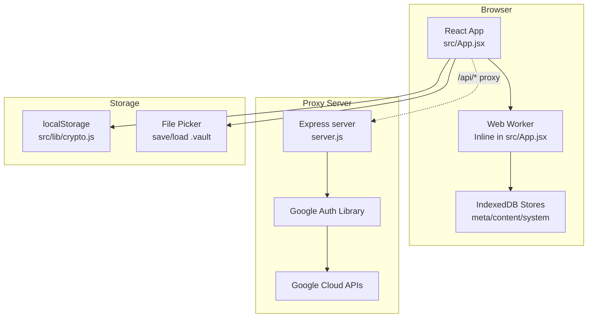
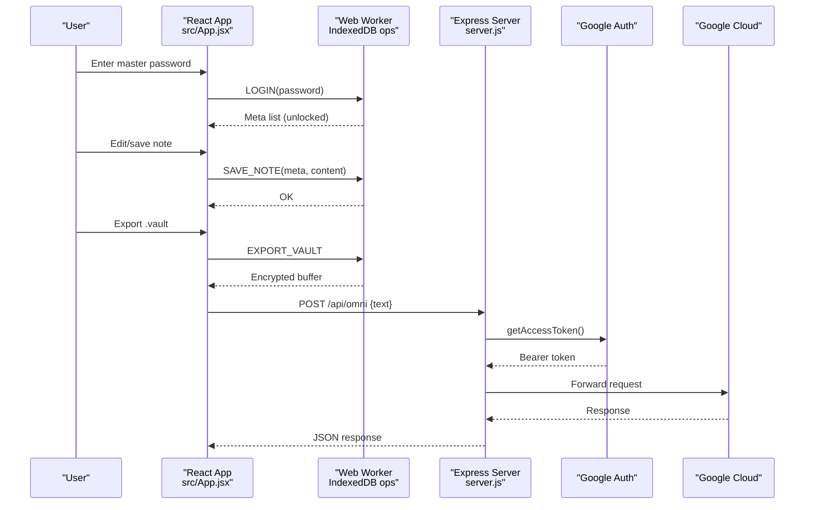
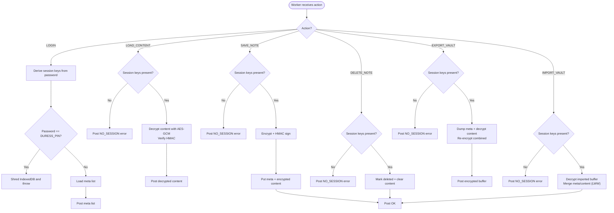
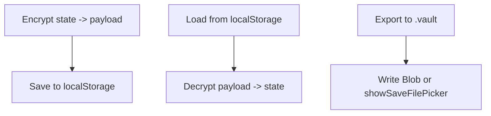
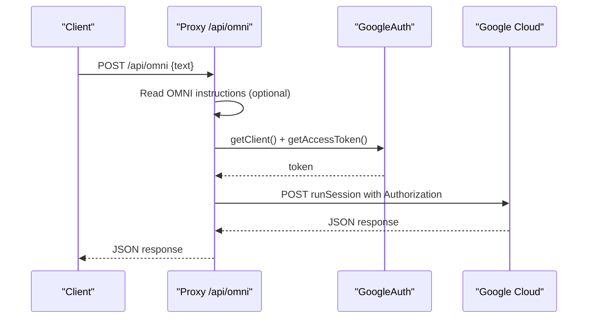
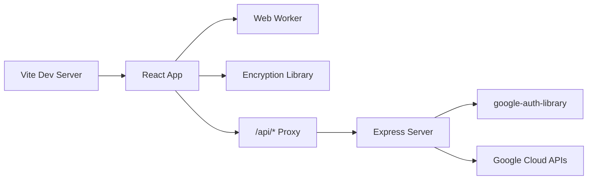

# Troubleshooting and FAQ

<cite>
**Referenced Files in This Document**
- [README.md](file://README.md)
- [package.json](file://package.json)
- [vite.config.js](file://vite.config.js)
- [Dockerfile](file://Dockerfile)
- [docker-compose.yml](file://docker-compose.yml)
- [index.html](file://index.html)
- [server.js](file://server.js)
- [src/App.jsx](file://src/App.jsx)
- [src/components/LockScreen.jsx](file://src/components/LockScreen.jsx)
- [src/components/VaultDashboard.jsx](file://src/components/VaultDashboard.jsx)
- [src/lib/crypto.js](file://src/lib/crypto.js)
</cite>

## Table of Contents
1. [Introduction](#introduction)
2. [Project Structure](#project-structure)
3. [Core Components](#core-components)
4. [Architecture Overview](#architecture-overview)
5. [Detailed Component Analysis](#detailed-component-analysis)
6. [Dependency Analysis](#dependency-analysis)
7. [Performance Considerations](#performance-considerations)
8. [Troubleshooting Guide](#troubleshooting-guide)
9. [Conclusion](#conclusion)
10. [Appendices](#appendices)

## Introduction
This document provides comprehensive troubleshooting and FAQ guidance for OMNI-TODO. It focuses on diagnosing and resolving common issues related to authentication failures, encryption errors, and performance problems. It also covers debugging techniques for Web Worker encryption, IndexedDB access, and Google Cloud API integration. Deployment and containerization concerns are addressed alongside Docker and Vite configurations. Security-related troubleshooting, including encryption validation and key derivation, is included. Finally, diagnostic tools, logging strategies, and monitoring approaches are documented to help identify and resolve problems efficiently.

## Project Structure
OMNI-TODO is a React + Vite application with a small Express proxy server for Google Cloud APIs. The frontend uses a Web Worker for IndexedDB-backed encryption and CRDT-like operations, and a separate library module for localStorage-based encryption of the vault file. The backend server proxies requests to Google Cloud Vertex AI and OMNI sessions.

**Diagram sources**
- [src/App.jsx:10-164](file://src/App.jsx#L10-L164)
- [src/lib/crypto.js:40-112](file://src/lib/crypto.js#L40-L112)
- [server.js:1-135](file://server.js#L1-L135)

**Section sources**
- [README.md:1-17](file://README.md#L1-L17)
- [package.json:1-40](file://package.json#L1-L40)
- [vite.config.js:1-19](file://vite.config.js#L1-L19)
- [Dockerfile:1-32](file://Dockerfile#L1-L32)
- [docker-compose.yml:1-18](file://docker-compose.yml#L1-L18)
- [index.html:1-14](file://index.html#L1-L14)

## Core Components
- Frontend encryption and storage:
  - Web Worker encryption with AES-GCM and HMAC-SHA-256 for IndexedDB-backed notes.
  - Local storage encryption with PBKDF2-derived AES-GCM for the vault file.
  - File picker support for importing/exporting .vault files.
- Backend proxy:
  - Express server with CORS and JSON parsing.
  - Google Auth integration for bearer token retrieval.
  - Proxies to Vertex AI image generation and OMNI session endpoints.
- Build and containerization:
  - Vite dev server with proxy to the Express server.
  - Dockerfile installing gcloud SDK and running both servers concurrently.
  - docker-compose exposing ports and sharing volumes.

**Section sources**
- [src/App.jsx:10-164](file://src/App.jsx#L10-L164)
- [src/lib/crypto.js:1-112](file://src/lib/crypto.js#L1-L112)
- [server.js:1-135](file://server.js#L1-L135)
- [vite.config.js:1-19](file://vite.config.js#L1-L19)
- [Dockerfile:1-32](file://Dockerfile#L1-L32)
- [docker-compose.yml:1-18](file://docker-compose.yml#L1-L18)

## Architecture Overview
The application separates concerns between the frontend (React + Web Worker + IndexedDB/localStorage) and the backend (Express proxy to Google Cloud). The Vite dev server proxies API calls to the Express server, which authenticates via Google Auth and forwards requests to Google Cloud.

**Diagram sources**
- [src/App.jsx:166-190](file://src/App.jsx#L166-L190)
- [server.js:21-81](file://server.js#L21-L81)

## Detailed Component Analysis

### Web Worker Encryption and IndexedDB
The Web Worker encapsulates IndexedDB stores for metadata, content, and system variables. It derives session keys from the master password and performs AES-GCM encryption with HMAC-SHA-256 integrity checks. It supports login, lock, load/save/delete notes, export/import vaults, and a duress mode that cryptographically shreds data.

**Diagram sources**
- [src/App.jsx:33-163](file://src/App.jsx#L33-L163)

**Section sources**
- [src/App.jsx:10-164](file://src/App.jsx#L10-L164)

### Local Storage Vault Encryption
The vault file encryption uses PBKDF2 with a stored salt and AES-GCM. It supports saving/loading the vault and exporting to a .vault file via the file picker or fallback download.

**Diagram sources**
- [src/lib/crypto.js:20-38](file://src/lib/crypto.js#L20-L38)
- [src/lib/crypto.js:43-60](file://src/lib/crypto.js#L43-L60)
- [src/lib/crypto.js:81-110](file://src/lib/crypto.js#L81-L110)

**Section sources**
- [src/lib/crypto.js:1-112](file://src/lib/crypto.js#L1-L112)

### Express Proxy Server and Google Cloud Integration
The Express server initializes Google Auth, reads optional OMNI instructions, retrieves an access token, and forwards requests to Vertex AI and OMNI session endpoints. It logs errors and returns structured JSON responses.

**Diagram sources**
- [server.js:13-81](file://server.js#L13-L81)

**Section sources**
- [server.js:1-135](file://server.js#L1-L135)

## Dependency Analysis
- Runtime dependencies include React, Three.js for shaders, Framer Motion for animations, and @xyflow/react for mindmaps.
- Dev/prod dependencies include Vite, Tailwind, ESLint, and Express for the proxy server.
- The proxy depends on google-auth-library for bearer tokens and Google Cloud endpoints.
- The Web Worker relies on SubtleCrypto for AES-GCM and HMAC, and IndexedDB for persistence.

**Diagram sources**
- [vite.config.js:7-17](file://vite.config.js#L7-L17)
- [server.js:1-135](file://server.js#L1-L135)
- [package.json:12-37](file://package.json#L12-L37)

**Section sources**
- [package.json:1-40](file://package.json#L1-L40)
- [vite.config.js:1-19](file://vite.config.js#L1-L19)
- [server.js:1-135](file://server.js#L1-L135)

## Performance Considerations
- IndexedDB operations:
  - Batch writes and transactions to minimize roundtrips.
  - Avoid large synchronous decryption loops; process in chunks if needed.
  - Use appropriate object store keys and indexes for frequent queries.
- Web Worker offloading:
  - Keep the main thread responsive; avoid long-running tasks in the UI.
  - Use debounced autosave (as implemented) to reduce write frequency.
- Encryption cost:
  - PBKDF2 iteration counts are tuned for security; avoid increasing further unless necessary.
  - Reuse session keys per session to avoid repeated key derivation overhead.
- Browser rendering:
  - Three.js shader rendering is lightweight; monitor pixel ratio and resize events.
- Memory management:
  - Revoke object URLs after Blob downloads.
  - Terminate workers when unmounting to free memory.

[No sources needed since this section provides general guidance]

## Troubleshooting Guide

### Authentication Failures
Symptoms:
- Login fails with “invalid password or corrupted data.”
- Immediate lock after unlocking.

Root causes and fixes:
- Incorrect master password:
  - Verify the password length and character set.
  - Ensure no accidental extra spaces.
- Corrupted IndexedDB or localStorage:
  - Clear IndexedDB and retry login to regenerate stores.
  - Remove the encrypted vault from localStorage and recreate.
- Duress PIN triggered:
  - If the password matches the configured PIN, the vault is shredded. Recovery is not possible.
  - Check the UI warning and avoid using the PIN accidentally.

Diagnostic steps:
- Inspect IndexedDB stores and system variables in browser dev tools.
- Confirm the Web Worker posts “NO_SESSION” when keys are missing.
- Review console logs for “DURESS_TRIGGERED.”

**Section sources**
- [src/App.jsx:216-226](file://src/App.jsx#L216-L226)
- [src/App.jsx:79-87](file://src/App.jsx#L79-L87)
- [src/components/LockScreen.jsx:80-87](file://src/components/LockScreen.jsx#L80-L87)

### Encryption Errors
Common issues:
- Decryption errors (“INTEGRITY_COMPROMISED,” “CORRUPTED_PAYLOAD”).
- Import/export failures.

Resolutions:
- Integrity verification failure:
  - Indicates tampering or corruption. Recreate the vault from a known-good backup.
  - Ensure HMAC verification runs before decryption.
- Corrupted payload:
  - Validate the payload format and lengths.
  - Re-export and re-import the vault file.
- Local storage vault:
  - Confirm the payload starts with the expected format marker.
  - Re-encrypt and save the vault after fixing the password.

**Section sources**
- [src/App.jsx:64-72](file://src/App.jsx#L64-L72)
- [src/lib/crypto.js:29-38](file://src/lib/crypto.js#L29-L38)
- [src/App.jsx:389-390](file://src/App.jsx#L389-L390)

### Performance Problems
Symptoms:
- Slow note editing, lag during save, or UI jank.

Checks and improvements:
- Autosave debounce:
  - The UI saves after 1.5 seconds of inactivity. Reduce manual save triggers.
- IndexedDB throughput:
  - Minimize concurrent writes; batch updates when possible.
- Encryption overhead:
  - Avoid re-deriving keys unnecessarily; reuse session keys.
- Rendering:
  - Monitor Three.js animation loop and resize handlers.

**Section sources**
- [src/components/VaultDashboard.jsx:268-274](file://src/components/VaultDashboard.jsx#L268-L274)
- [src/App.jsx:33-42](file://src/App.jsx#L33-L42)

### Debugging Web Worker Encryption and IndexedDB
Techniques:
- Enable browser dev tools and inspect the Web Worker messages.
- Add temporary logging around key derivation, encryption, and decryption.
- Verify transaction completion and error callbacks.
- Test with a fresh IndexedDB database to isolate corruption.

**Section sources**
- [src/App.jsx:167-190](file://src/App.jsx#L167-L190)
- [src/App.jsx:173-180](file://src/App.jsx#L173-L180)

### IndexedDB Access Issues
Symptoms:
- Cannot open database, upgrade needed, or transaction failures.

Resolutions:
- Clear IndexedDB for the origin and allow schema creation on next open.
- Ensure IndexedDB is supported and not blocked by private/incognito mode restrictions.
- Verify object store names and key paths.

**Section sources**
- [src/App.jsx:15-28](file://src/App.jsx#L15-L28)

### Google Cloud API Integration
Symptoms:
- Proxy returns 401/403 or internal server errors.
- Requests fail with authentication or endpoint errors.

Checks and fixes:
- Ensure proper Google Cloud credentials are available to the container.
- Confirm the service account has required permissions for Vertex AI and OMNI endpoints.
- Validate the Authorization header and request body format.
- Review server logs for detailed error responses.

**Section sources**
- [server.js:13-16](file://server.js#L13-L16)
- [server.js:37-81](file://server.js#L37-L81)
- [server.js:91-129](file://server.js#L91-L129)

### Docker Containerization and Deployment
Common issues:
- Ports not exposed or reachable.
- gcloud SDK not installed or credentials missing.
- Vite and Express not running concurrently.

Resolutions:
- Expose ports 5173 (Vite) and 3001 (Express) as configured.
- Mount or configure gcloud credentials inside the container.
- Use the provided CMD to run both servers; verify logs for startup.

**Section sources**
- [Dockerfile:23-31](file://Dockerfile#L23-L31)
- [docker-compose.yml:6-17](file://docker-compose.yml#L6-L17)

### Build Failures
Symptoms:
- Vite build fails or hot reload does not work.

Checks:
- Ensure Node.js and npm dependencies are installed.
- Verify Vite proxy configuration targets the Express server.
- Confirm environment variables and hosts are allowed.

**Section sources**
- [vite.config.js:7-17](file://vite.config.js#L7-L17)
- [package.json:6-11](file://package.json#L6-L11)

### Logging Strategies and Monitoring
Recommended practices:
- Frontend:
  - Use console.error for recoverable failures (e.g., auto-save).
  - Surface user-facing errors via the UI.
- Backend:
  - Log API error responses and unexpected exceptions.
  - Track request latency and error rates.
- Observability:
  - Add metrics for IndexedDB operations and encryption durations.
  - Monitor container resource usage and health.

**Section sources**
- [src/lib/crypto.js:47-48](file://src/lib/crypto.js#L47-L48)
- [server.js:78-80](file://server.js#L78-L80)
- [server.js:119-121](file://server.js#L119-L121)

### Security-Related Troubleshooting
- Encryption validation:
  - Verify PBKDF2 parameters and key derivation outputs.
  - Ensure HMAC verification precedes decryption.
- Key derivation issues:
  - Confirm salt persistence and uniqueness per session.
  - Avoid weak passwords and enforce minimum length.
- Duress mode:
  - Understand that triggering the PIN leads to irreversible data destruction.

**Section sources**
- [src/App.jsx:33-42](file://src/App.jsx#L33-L42)
- [src/App.jsx](file://src/App.jsx#L80)
- [src/components/LockScreen.jsx:80-87](file://src/components/LockScreen.jsx#L80-L87)

### Frequently Asked Questions

Q: How do I recover my data if I forget the master password?
A: Master password recovery is not supported. If you used the duress PIN, data is destroyed and unrecoverable. Use a secure password manager for the master password.

Q: Can I import/export my notes outside the app?
A: Yes, export a .vault file and import it later. The file is encrypted with AES-GCM and PBKDF2.

Q: Why does the app require IndexedDB?
A: IndexedDB is used by the Web Worker for encrypted note storage. Without it, the app cannot persist notes.

Q: How do I fix authentication errors with Google Cloud?
A: Ensure gcloud credentials are configured inside the container and the service account has required permissions. Check the proxy logs for detailed error messages.

Q: What browsers are supported?
A: The app uses modern web APIs (Web Workers, SubtleCrypto, IndexedDB). Use recent Chromium-based browsers for best compatibility.

Q: How do I reset the vault?
A: Clear IndexedDB and localStorage entries for the vault. Recreate the vault with a new master password.

**Section sources**
- [src/components/LockScreen.jsx:80-87](file://src/components/LockScreen.jsx#L80-L87)
- [src/lib/crypto.js:43-60](file://src/lib/crypto.js#L43-L60)
- [src/App.jsx:44-52](file://src/App.jsx#L44-L52)
- [server.js:13-16](file://server.js#L13-L16)

## Conclusion
This guide consolidates practical troubleshooting steps for OMNI-TODO’s authentication, encryption, performance, and deployment concerns. By following the diagnostics and resolutions outlined here—especially around IndexedDB integrity, Web Worker encryption, Google Cloud authentication, and Docker configuration—you can quickly identify and fix most issues. Adopt the recommended logging and monitoring practices to proactively detect and address problems.

[No sources needed since this section summarizes without analyzing specific files]

## Appendices

### Quick Reference: Common Error Messages
- “NO_SESSION”: Session keys not derived; unlock again.
- “DURESS_TRIGGERED”: Duress PIN activated; data destroyed.
- “INTEGRITY_COMPROMISED”: HMAC verification failed; check payload.
- “CORRUPTED_PAYLOAD”: Payload too short or malformed.
- “Invalid format”: Imported vault file format mismatch.

**Section sources**
- [src/App.jsx:80-87](file://src/App.jsx#L80-L87)
- [src/App.jsx:66-71](file://src/App.jsx#L66-L71)
- [src/App.jsx:31-32](file://src/App.jsx#L31-L32)
- [src/App.jsx](file://src/App.jsx#L378)