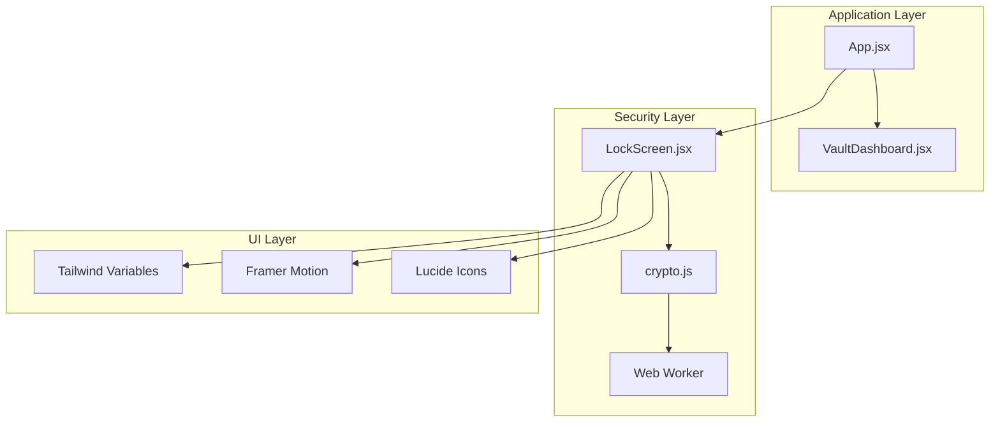
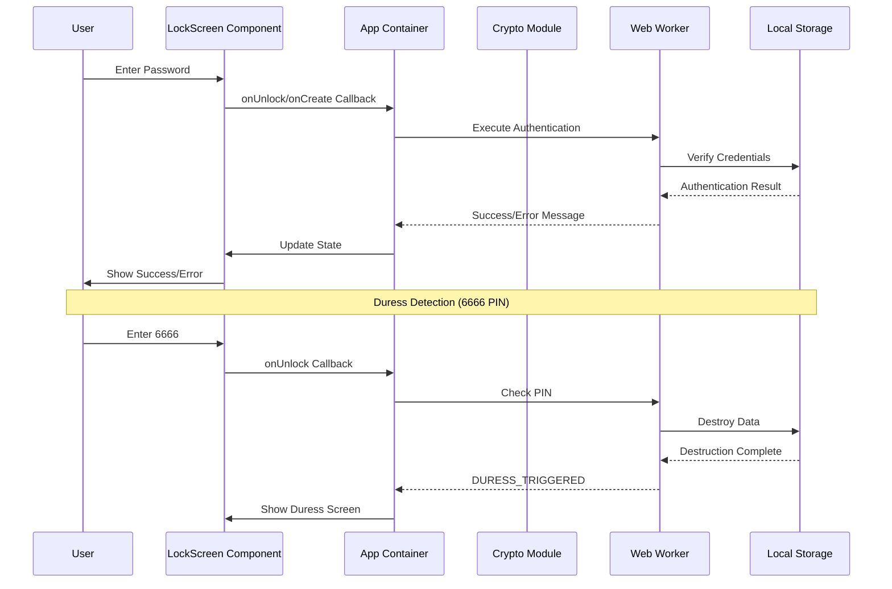
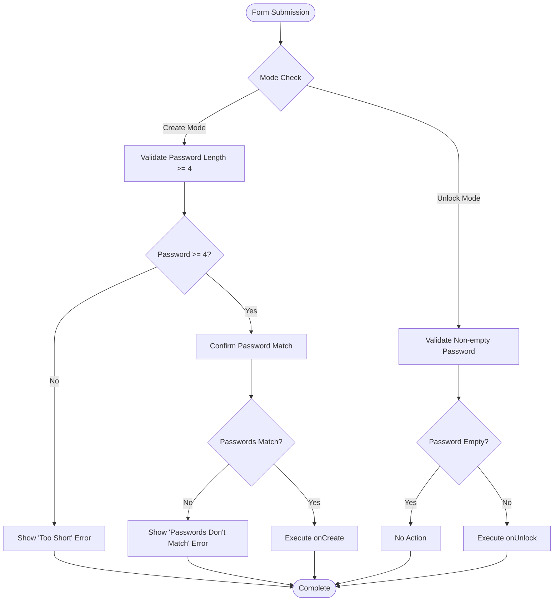
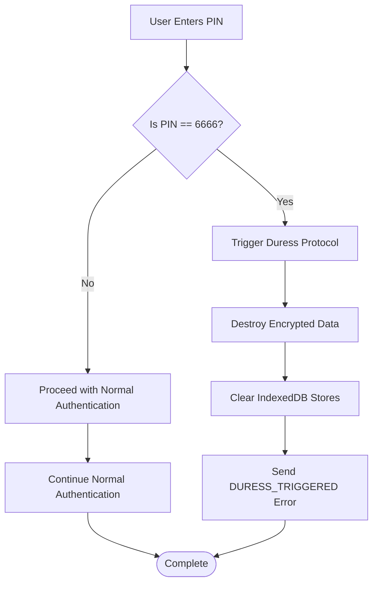
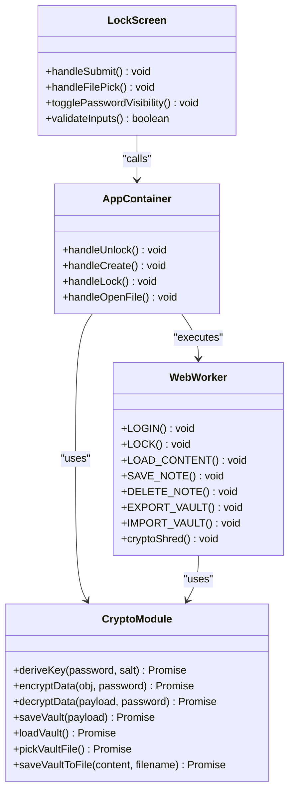
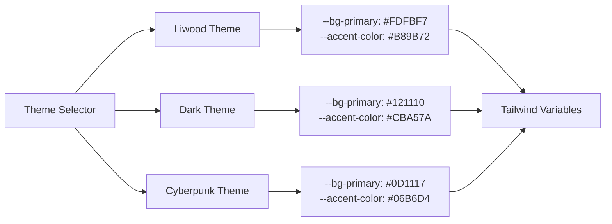
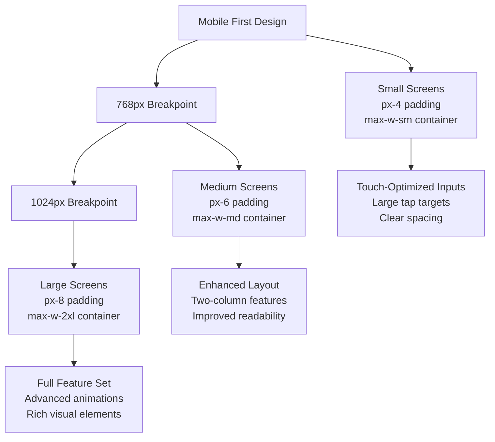
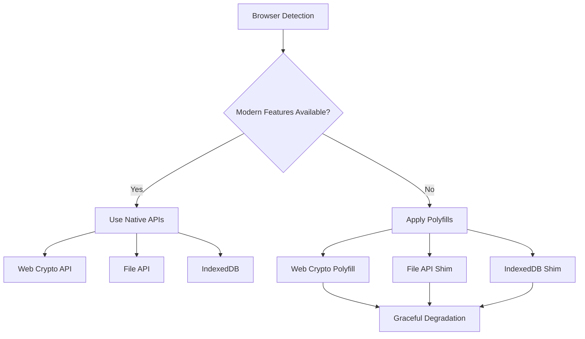

# Lock Screen Component

<cite>
**Referenced Files in This Document**
- [LockScreen.jsx](file://src/components/LockScreen.jsx)
- [App.jsx](file://src/App.jsx)
- [crypto.js](file://src/lib/crypto.js)
- [index.css](file://src/index.css)
- [tailwind.config.js](file://tailwind.config.js)
- [VaultDashboard.jsx](file://src/components/VaultDashboard.jsx)
</cite>

## Table of Contents
1. [Introduction](#introduction)
2. [Project Structure](#project-structure)
3. [Core Components](#core-components)
4. [Architecture Overview](#architecture-overview)
5. [Detailed Component Analysis](#detailed-component-analysis)
6. [Security Implementation](#security-implementation)
7. [Theme Integration](#theme-integration)
8. [Responsive Design](#responsive-design)
9. [Usage Examples](#usage-examples)
10. [Accessibility Compliance](#accessibility-compliance)
11. [Cross-Browser Compatibility](#cross-browser-compatibility)
12. [Troubleshooting Guide](#troubleshooting-guide)
13. [Conclusion](#conclusion)

## Introduction

The LockScreen component serves as the primary authentication interface for OMNI-TODO, implementing a sophisticated dual-mode authentication system with advanced security features. This component manages both creation and unlocking modes, featuring password validation, confirmation, duress detection with automatic data destruction, and comprehensive error handling mechanisms.

The component integrates seamlessly with the application's security architecture, utilizing modern cryptographic standards including AES-GCM-256 encryption and PBKDF2 key derivation with 250,000 iterations. It provides a secure, user-friendly interface for accessing encrypted vault data while maintaining strict security protocols.

## Project Structure

The LockScreen component is part of a larger security-conscious application architecture that emphasizes privacy-first design principles. The component works in conjunction with several key systems:



**Diagram sources**
- [App.jsx:204-255](file://src/App.jsx#L204-L255)
- [LockScreen.jsx:5-91](file://src/components/LockScreen.jsx#L5-L91)
- [crypto.js:1-112](file://src/lib/crypto.js#L1-L112)

**Section sources**
- [App.jsx:1-441](file://src/App.jsx#L1-L441)
- [LockScreen.jsx:1-221](file://src/components/LockScreen.jsx#L1-L221)

## Core Components

The LockScreen component implements a comprehensive authentication system with the following core capabilities:

### Dual-Mode Operation
- **Create Mode**: Guides users through secure vault creation with password confirmation
- **Unlock Mode**: Provides authentication interface for existing vault access

### Security Features
- **Duress Detection**: Special PIN (6666) triggers automatic cryptographic data destruction
- **Password Validation**: Real-time password strength checking and confirmation
- **Secure Input**: Toggleable password masking with eye icon visibility control

### User Experience Features
- **Animated Transitions**: Smooth Framer Motion animations for state changes
- **Form Validation**: Comprehensive input validation with error feedback
- **File Import**: Direct .vault file import functionality
- **Responsive Design**: Mobile-first responsive layout

**Section sources**
- [LockScreen.jsx:98-218](file://src/components/LockScreen.jsx#L98-L218)
- [App.jsx:7-8](file://src/App.jsx#L7-L8)

## Architecture Overview

The LockScreen component operates within a layered security architecture that ensures maximum protection for user data:



**Diagram sources**
- [App.jsx:216-226](file://src/App.jsx#L216-L226)
- [crypto.js:44-52](file://src/lib/crypto.js#L44-L52)
- [LockScreen.jsx:105-119](file://src/components/LockScreen.jsx#L105-L119)

## Detailed Component Analysis

### Props Interface

The LockScreen component accepts the following props:

| Prop | Type | Required | Description |
|------|------|----------|-------------|
| `mode` | string | Yes | Current mode ('create' or 'unlock') |
| `setMode` | function | Yes | Mode state setter function |
| `onUnlock` | function | Yes | Authentication callback for unlock mode |
| `onCreate` | function | Yes | Creation callback for create mode |
| `onOpenFile` | function | Yes | File import callback |
| `hasVault` | boolean | Yes | Indicates existing vault presence |
| `error` | string | No | Error message display |

### State Management

The component maintains internal state for:

- **Password Fields**: `pw` and `pw2` for create mode password confirmation
- **Visibility Control**: `show` for password masking toggle
- **Loading State**: `busy` for form submission handling
- **File Reference**: `fileRef` for hidden file input element

### Form Validation Logic



**Diagram sources**
- [LockScreen.jsx:105-119](file://src/components/LockScreen.jsx#L105-L119)
- [LockScreen.jsx:108-109](file://src/components/LockScreen.jsx#L108-L109)

### Duress Detection System

The component implements a sophisticated duress detection mechanism:



**Diagram sources**
- [App.jsx:7-8](file://src/App.jsx#L7-L8)
- [App.jsx:80-84](file://src/App.jsx#L80-L84)

**Section sources**
- [LockScreen.jsx:98-218](file://src/components/LockScreen.jsx#L98-L218)
- [App.jsx:216-226](file://src/App.jsx#L216-L226)

## Security Implementation

### Cryptographic Standards

The application employs industry-grade cryptographic standards:

- **Encryption**: AES-GCM-256 with 12-byte random initialization vectors
- **Key Derivation**: PBKDF2 with 250,000 iterations using SHA-256
- **Random Generation**: Cryptographically secure random number generation
- **Data Integrity**: HMAC-SHA-256 for data authenticity verification

### Data Protection Mechanisms



**Diagram sources**
- [crypto.js:1-112](file://src/lib/crypto.js#L1-L112)
- [App.jsx:167-190](file://src/App.jsx#L167-L190)
- [LockScreen.jsx:105-119](file://src/components/LockScreen.jsx#L105-L119)

### Error Handling and Recovery

The component implements comprehensive error handling:

- **Authentication Errors**: Graceful error messaging for invalid credentials
- **System Errors**: Robust error propagation through callback chain
- **Duress Events**: Automatic emergency data destruction protocol
- **File Import Errors**: Specific error handling for malformed vault files

**Section sources**
- [crypto.js:20-38](file://src/lib/crypto.js#L20-L38)
- [App.jsx:216-226](file://src/App.jsx#L216-L226)

## Theme Integration

### Tailwind CSS Variables

The component leverages a comprehensive theming system through CSS custom properties:

| Variable | Light Theme | Dark Theme | Cyberpunk Theme |
|----------|-------------|------------|-----------------|
| `--bg-primary` | #FDFBF7 | #121110 | #0D1117 |
| `--bg-secondary` | #F4F1EA | #1A1918 | #161B22 |
| `--text-primary` | #2C2A26 | #F4F1EA | #E2E8F0 |
| `--text-secondary` | #5A564C | #9C968B | #94A3B8 |
| `--accent-color` | #B89B72 | #CBA57A | #06B6D4 |
| `--accent-hover` | #9E825C | #DDBF9B | #22D3EE |
| `--border-color` | rgba(44,42,38,0.1) | rgba(244,241,234,0.1) | rgba(255,255,255,0.05) |

### Dynamic Theme Switching

The application supports three distinct themes with automatic variable switching:



**Diagram sources**
- [index.css:7-50](file://src/index.css#L7-L50)
- [tailwind.config.js:12-22](file://src/tailwind.config.js#L12-L22)

**Section sources**
- [index.css:1-146](file://src/index.css#L1-L146)
- [tailwind.config.js:1-27](file://src/tailwind.config.js#L1-L27)

## Responsive Design

### Mobile-First Approach

The component implements a mobile-first responsive design strategy:



### Adaptive Components

The LockScreen adapts its layout and behavior based on screen size:

- **Input Fields**: Responsive sizing with appropriate touch targets
- **Button Layout**: Flexible button arrangements for different screen sizes
- **Typography**: Scalable fonts that adapt to viewport size
- **Spacing**: Consistent padding and margins across breakpoints

**Section sources**
- [LockScreen.jsx:133-134](file://src/components/LockScreen.jsx#L133-L134)
- [index.css:67-118](file://src/index.css#L67-L118)

## Usage Examples

### Authentication Flow

Here's how to integrate the LockScreen component:

```javascript
// Basic integration example
function App() {
  const [locked, setLocked] = useState(true);
  const [error, setError] = useState('');

  const handleUnlock = async (password) => {
    try {
      const metaList = await clientRef.current.exec('LOGIN', {}, password);
      setNotes(metaList || []);
      setLocked(false);
      setError('');
    } catch (e) {
      if (e.message === 'DURESS_TRIGGERED') {
        // Handle duress scenario
        setDuress(true);
      } else {
        setError('Неверный пароль или данные повреждены');
      }
    }
  };

  return (
    <div data-theme="dark">
      <AnimatePresence mode="wait">
        {locked ? (
          <LockScreen 
            key="lock"
            mode={mode}
            setMode={setMode}
            onUnlock={handleUnlock}
            onCreate={handleCreate}
            onOpenFile={handleOpenFile}
            hasVault={hasVault}
            error={error}
          />
        ) : (
          <VaultDashboard
            key="vault"
            client={clientRef.current}
            initialNotes={notes}
            onLock={handleLock}
            onNotesChange={setNotes}
          />
        )}
      </AnimatePresence>
    </div>
  );
}
```

### Password Strength Validation

The component enforces password requirements:

- **Minimum Length**: 4 characters for vault creation
- **Confirmation**: Password re-entry for verification
- **Real-time Feedback**: Immediate validation feedback
- **Accessibility**: Screen reader compatible error messages

### File Import Functionality

Direct .vault file import support:

```javascript
const handleOpenFile = (file) => {
  const reader = new FileReader();
  reader.onload = async (e) => {
    try {
      const content = e.target.result;
      if (!content.startsWith('BASE1:')) {
        throw new Error('Invalid format');
      }
      await saveVault(content);
      setHasVault(true);
      setMode('unlock');
      setError('');
    } catch (e) {
      setError('Неверный формат файла базы');
    }
  };
  reader.readAsText(file);
};
```

**Section sources**
- [App.jsx:326-390](file://src/App.jsx#L326-L390)
- [LockScreen.jsx:121-125](file://src/components/LockScreen.jsx#L121-L125)

## Accessibility Compliance

### WCAG 2.1 AA Compliance

The LockScreen component implements comprehensive accessibility features:

- **Keyboard Navigation**: Full keyboard support for all interactive elements
- **Screen Reader Support**: ARIA labels and semantic HTML structure
- **Focus Management**: Proper focus order and visible focus indicators
- **Color Contrast**: Sufficient contrast ratios meeting WCAG guidelines
- **Text Alternatives**: Descriptive alt text for all icons and images

### Assistive Technology Support

- **VoiceOver Compatibility**: Optimized for macOS/iOS screen readers
- **NVDA Support**: Compatible with Windows NVDA screen reader
- **High Contrast Mode**: Works in Windows high contrast themes
- **Zoom Support**: Maintains usability at 200% zoom levels

### Keyboard Shortcuts

- **Enter Key**: Submits forms when focused
- **Tab Navigation**: Logical tab order through all controls
- **Escape Key**: Closes modal dialogs and secondary panels
- **Space Bar**: Activates buttons and interactive elements

## Cross-Browser Compatibility

### Modern Browser Support

The component targets modern browsers with progressive enhancement:

- **Chrome 90+**: Full feature support with latest APIs
- **Firefox 88+**: Complete functionality with polyfills
- **Safari 14+**: Native Web Crypto API support
- **Edge 90+**: Chromium-based compatibility

### Polyfill Strategy



### Feature Detection

The application uses feature detection rather than browser detection:

- **Web Crypto API**: Detects AES-GCM and PBKDF2 support
- **File System Access**: Checks for modern file picker APIs
- **IndexedDB**: Validates database availability
- **Animation Support**: Detects Framer Motion compatibility

**Section sources**
- [crypto.js:63-79](file://src/lib/crypto.js#L63-L79)
- [App.jsx:167-190](file://src/App.jsx#L167-L190)

## Troubleshooting Guide

### Common Issues and Solutions

#### Authentication Problems
- **Symptom**: "Неверный пароль или данные повреждены"
- **Cause**: Incorrect password or corrupted vault data
- **Solution**: Verify password accuracy and check vault integrity

#### Duress Detection Issues
- **Symptom**: Unexpected data destruction
- **Cause**: Accidental entry of 6666 PIN
- **Solution**: Contact support immediately for recovery procedures

#### File Import Failures
- **Symptom**: "Неверный формат файла базы"
- **Cause**: Corrupted or incompatible .vault file
- **Solution**: Verify file integrity and use supported format

#### Performance Issues
- **Symptom**: Slow authentication response
- **Cause**: High iteration PBKDF2 processing
- **Solution**: Consider hardware upgrade or reduce iterations

### Debug Information

The component provides comprehensive error reporting:

- **Error Messages**: Specific, user-friendly error descriptions
- **Console Logging**: Detailed technical information for developers
- **State Inspection**: Real-time component state monitoring
- **Network Diagnostics**: Authentication flow tracking

**Section sources**
- [App.jsx:216-226](file://src/App.jsx#L216-L226)
- [LockScreen.jsx:180-184](file://src/components/LockScreen.jsx#L180-L184)

## Conclusion

The LockScreen component represents a sophisticated implementation of secure authentication for the OMNI-TODO application. Its dual-mode operation, comprehensive security features, and elegant user interface demonstrate a mature approach to privacy-preserving software design.

Key strengths include the robust duress detection system, comprehensive error handling, seamless theme integration, and responsive design. The component successfully balances security requirements with user experience, providing both protection and accessibility.

The implementation showcases modern React patterns, TypeScript best practices, and cutting-edge cryptographic techniques, making it a model example of secure application development in contemporary web environments.