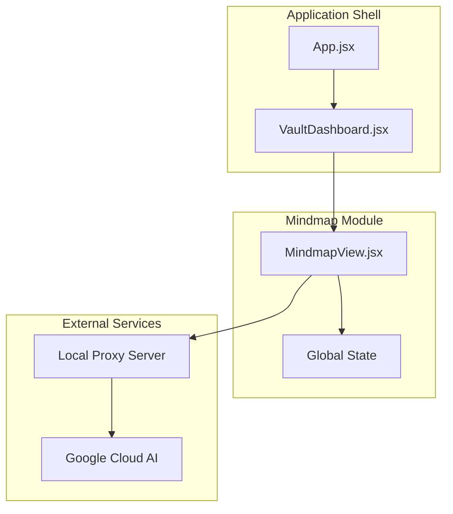
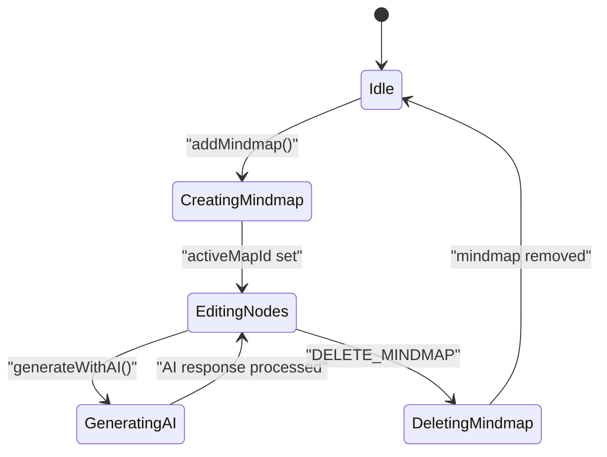
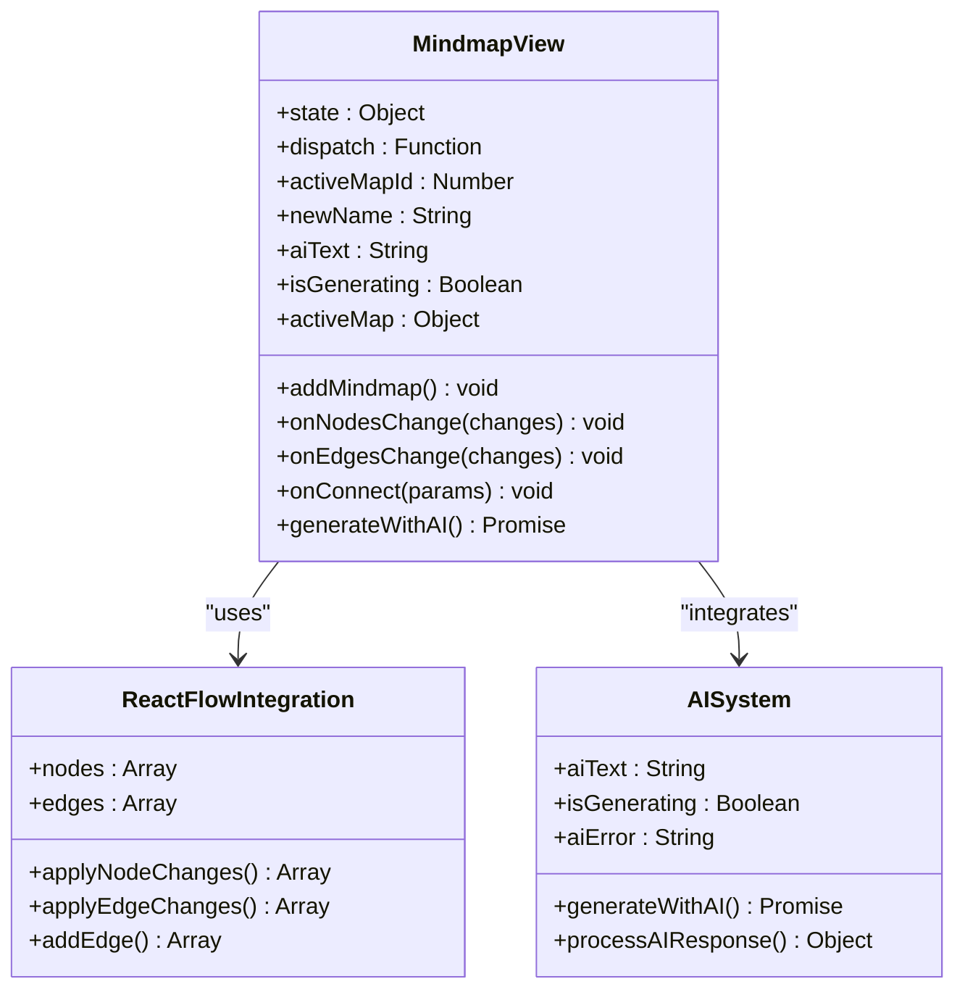
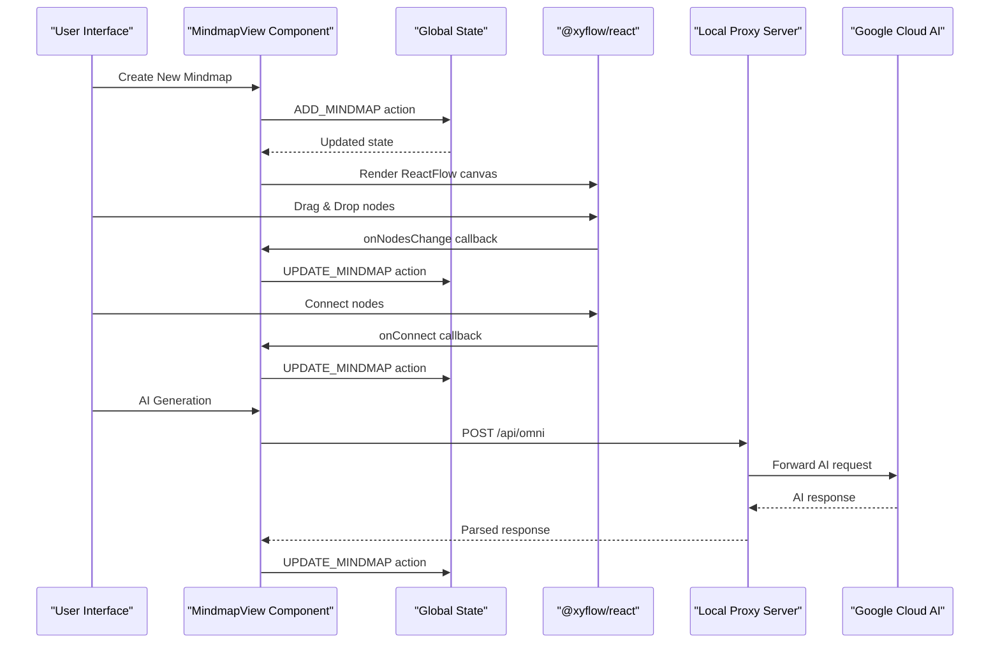
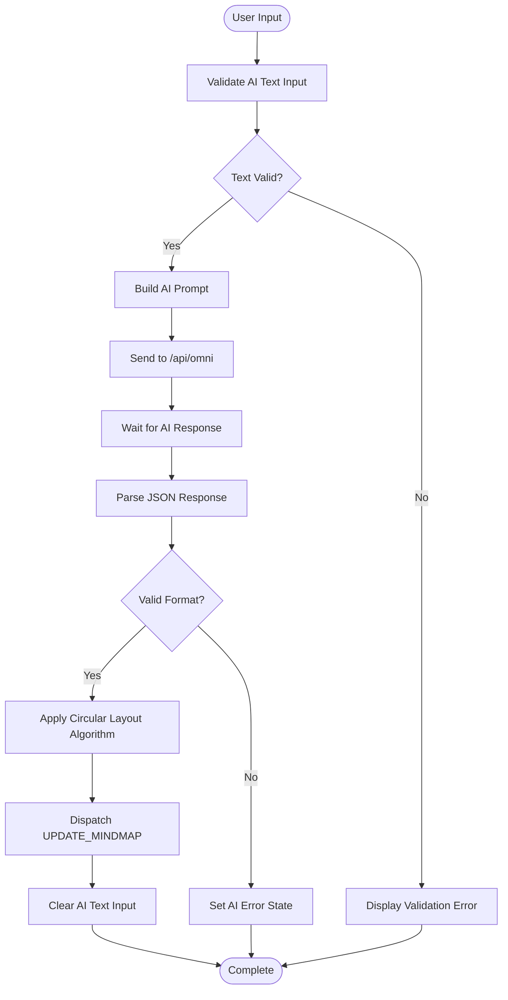
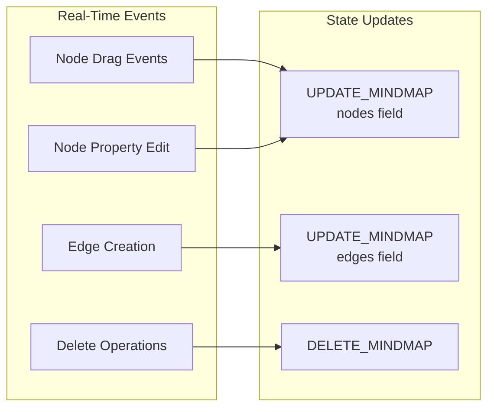
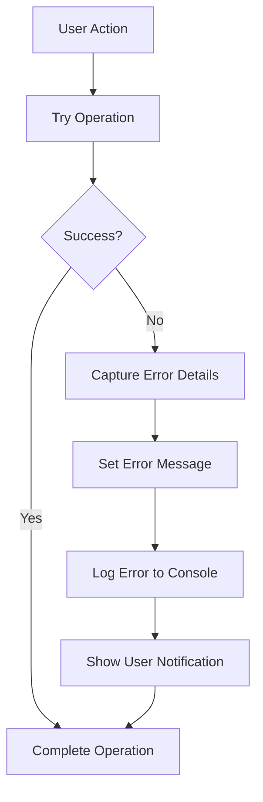

# Mindmap View Component

<cite>
**Referenced Files in This Document**
- [MindmapView.jsx](file://src/components/MindmapView.jsx)
- [App.jsx](file://src/App.jsx)
- [server.js](file://server.js)
- [package.json](file://package.json)
- [VaultDashboard.jsx](file://src/components/VaultDashboard.jsx)
</cite>

## Table of Contents
1. [Introduction](#introduction)
2. [Project Structure](#project-structure)
3. [Core Components](#core-components)
4. [Architecture Overview](#architecture-overview)
5. [Detailed Component Analysis](#detailed-component-analysis)
6. [Dependency Analysis](#dependency-analysis)
7. [Performance Considerations](#performance-considerations)
8. [Troubleshooting Guide](#troubleshooting-guide)
9. [Conclusion](#conclusion)

## Introduction
The Mindmap View component is the interactive diagram editor for OMNI-TODO, built with React and @xyflow/react. It enables users to create, edit, and visualize mind maps with real-time node manipulation, connection management, and AI-powered content extraction. The component integrates seamlessly with the application's global state management and connects to Google Cloud AI services for advanced mind map generation and enhancement.

## Project Structure
The Mindmap View component is organized within the components directory and integrates with the main application shell and state management system.



**Diagram sources**
- [App.jsx:308-441](file://src/App.jsx#L308-L441)
- [VaultDashboard.jsx:1510-1513](file://src/components/VaultDashboard.jsx#L1510-L1513)
- [MindmapView.jsx:7-310](file://src/components/MindmapView.jsx#L7-L310)

**Section sources**
- [App.jsx:308-441](file://src/App.jsx#L308-L441)
- [VaultDashboard.jsx:1510-1513](file://src/components/VaultDashboard.jsx#L1510-L1513)
- [MindmapView.jsx:7-310](file://src/components/MindmapView.jsx#L7-L310)

## Core Components
The Mindmap View component consists of several key subsystems that work together to provide a comprehensive mind mapping experience.

### State Management Architecture
The component utilizes React's useState and useMemo hooks for efficient state management and computation caching.



**Diagram sources**
- [MindmapView.jsx:20-31](file://src/components/MindmapView.jsx#L20-L31)
- [MindmapView.jsx:78-152](file://src/components/MindmapView.jsx#L78-L152)
- [App.jsx:289-294](file://src/App.jsx#L289-L294)

### Node Manipulation System
The component provides comprehensive node creation, deletion, and connection management through @xyflow/react integration.



**Diagram sources**
- [MindmapView.jsx:33-76](file://src/components/MindmapView.jsx#L33-L76)
- [MindmapView.jsx:78-152](file://src/components/MindmapView.jsx#L78-L152)

**Section sources**
- [MindmapView.jsx:7-310](file://src/components/MindmapView.jsx#L7-L310)
- [App.jsx:273-306](file://src/App.jsx#L273-L306)

## Architecture Overview
The Mindmap View component follows a unidirectional data flow pattern, integrating with the application's global state management system and external AI services.



**Diagram sources**
- [MindmapView.jsx:20-31](file://src/components/MindmapView.jsx#L20-L31)
- [MindmapView.jsx:33-76](file://src/components/MindmapView.jsx#L33-L76)
- [MindmapView.jsx:78-152](file://src/components/MindmapView.jsx#L78-L152)
- [server.js:21-81](file://server.js#L21-L81)

## Detailed Component Analysis

### Props Interface and Event Handlers
The Mindmap View component accepts two primary props and exposes a clean interface for parent components.

**Props Interface:**
- `state`: Object containing the current application state with mindmaps array
- `dispatch`: Function for dispatching state update actions

**Event Handlers:**
- `onNodesChange`: Handles node position and property changes
- `onEdgesChange`: Manages edge updates and modifications
- `onConnect`: Processes new edge connections between nodes

### AI-Powered Mind Map Generation
The component integrates with Google Cloud AI services through a local proxy server to extract mind maps from text content.



**Diagram sources**
- [MindmapView.jsx:78-152](file://src/components/MindmapView.jsx#L78-L152)
- [server.js:21-81](file://server.js#L21-L81)

### Automatic Node Positioning Algorithm
The component implements a circular layout algorithm for automatically positioned AI-generated nodes.

**Position Calculation:**
- Center coordinates: (250, 250)
- Radius: 150 pixels
- Angular spacing: 2π/n radians per node
- Position formula: x = center_x + radius × cos(angle), y = center_y + radius × sin(angle)

### Real-Time Editing Capabilities
The component provides comprehensive real-time editing through ReactFlow's event system.



**Diagram sources**
- [MindmapView.jsx:33-76](file://src/components/MindmapView.jsx#L33-L76)
- [App.jsx:289-294](file://src/App.jsx#L289-L294)

**Section sources**
- [MindmapView.jsx:78-152](file://src/components/MindmapView.jsx#L78-L152)
- [server.js:21-81](file://server.js#L21-L81)

## Dependency Analysis
The Mindmap View component relies on several key dependencies for its functionality.

```mermaid
graph TB
subgraph "Core Dependencies"
React[React 19.2.6]
XYFlow[@xyflow/react 12.11.1]
FramerMotion[Framer Motion 12.40.0]
LucideIcons[Lucide React 1.21.0]
end
subgraph "Application Dependencies"
Express[Express 5.2.1]
CORS[CORS 2.8.6]
GoogleAuth[Google Auth Library 10.7.0]
end
MindmapView --> React
MindmapView --> XYFlow
MindmapView --> FramerMotion
MindmapView --> LucideIcons
Server --> Express
Server --> GoogleAuth
Server --> CORS
```

**Diagram sources**
- [package.json:12-24](file://package.json#L12-L24)
- [server.js:1-16](file://server.js#L1-L16)

### Integration Points
The component integrates with multiple system components:

**State Management Integration:**
- Uses Redux-style reducers for state updates
- Implements immutable state updates
- Supports undo/redo through change callbacks

**UI Framework Integration:**
- Tailwind CSS for styling
- Responsive design patterns
- Theme-aware components

**External Service Integration:**
- Google Cloud AI Platform
- Local proxy server for API requests
- Authentication and authorization

**Section sources**
- [package.json:12-24](file://package.json#L12-L24)
- [server.js:13-16](file://server.js#L13-L16)

## Performance Considerations
The Mindmap View component implements several performance optimizations for handling large diagrams efficiently.

### Memory Management
- **Lazy Loading**: Mind maps are loaded only when selected
- **State Memoization**: Active map computation cached with useMemo
- **Event Callback Optimization**: useCallback prevents unnecessary re-renders

### Rendering Optimizations
- **Conditional Rendering**: Separate UI for list view vs. editor view
- **Animation Control**: Framer Motion animations only when needed
- **Component Splitting**: Large components split into smaller, focused units

### Large Diagram Handling
- **Virtual Scrolling**: Not implemented but could be added for very large graphs
- **Batch Updates**: Multiple changes applied in single state update cycles
- **Efficient Change Detection**: ReactFlow's optimized change application

## Troubleshooting Guide

### Common Issues and Solutions

**AI Generation Failures:**
- Verify `/api/omni` endpoint is reachable
- Check Google Cloud AI service availability
- Ensure proper authentication tokens are configured

**Node Positioning Problems:**
- Confirm ReactFlow container has proper dimensions
- Verify CSS variables for theme colors are defined
- Check for conflicting CSS styles affecting positioning

**State Synchronization Issues:**
- Ensure dispatch function is properly passed down
- Verify reducer actions match expected payload structure
- Check for concurrent state mutations

### Error Handling Patterns
The component implements comprehensive error handling for various failure scenarios:



**Diagram sources**
- [MindmapView.jsx:146-151](file://src/components/MindmapView.jsx#L146-L151)

**Section sources**
- [MindmapView.jsx:146-151](file://src/components/MindmapView.jsx#L146-L151)

## Conclusion
The Mindmap View component provides a robust, scalable solution for interactive mind mapping within the OMNI-TODO ecosystem. Its integration with @xyflow/react delivers professional-grade diagram editing capabilities, while the AI-powered content extraction enhances productivity through automated mind map generation. The component's architecture supports future enhancements including collaborative editing, advanced layout algorithms, and expanded AI integrations.

The implementation demonstrates best practices in React component design, including proper state management, performance optimization, and comprehensive error handling. The modular architecture ensures maintainability and extensibility for future feature additions.