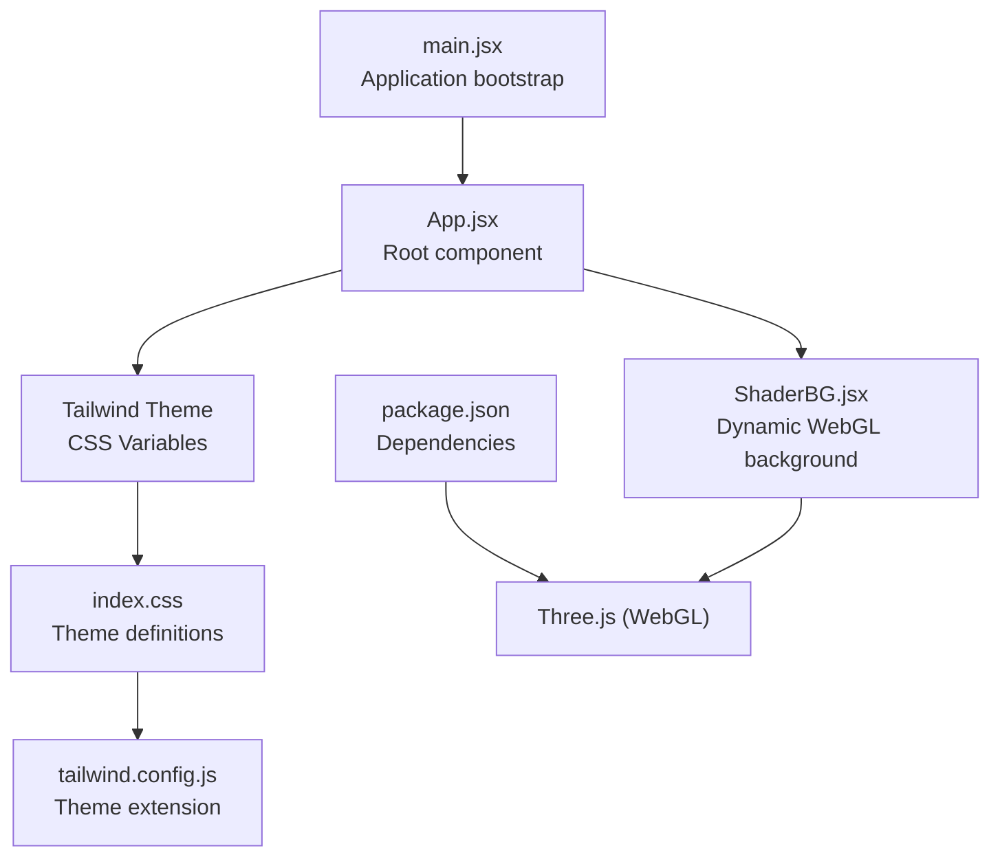
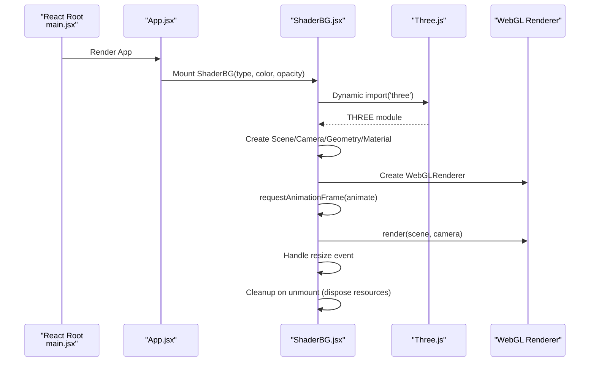
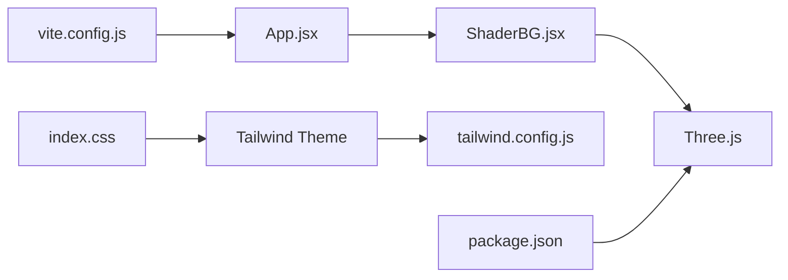

# Shader Background Component

<cite>
**Referenced Files in This Document**
- [ShaderBG.jsx](file://src/components/ShaderBG.jsx)
- [App.jsx](file://src/App.jsx)
- [main.jsx](file://src/main.jsx)
- [index.css](file://src/index.css)
- [tailwind.config.js](file://tailwind.config.js)
- [package.json](file://package.json)
- [vite.config.js](file://vite.config.js)
</cite>

## Table of Contents
1. [Introduction](#introduction)
2. [Project Structure](#project-structure)
3. [Core Components](#core-components)
4. [Architecture Overview](#architecture-overview)
5. [Detailed Component Analysis](#detailed-component-analysis)
6. [Dependency Analysis](#dependency-analysis)
7. [Performance Considerations](#performance-considerations)
8. [Troubleshooting Guide](#troubleshooting-guide)
9. [Conclusion](#conclusion)
10. [Appendices](#appendices)

## Introduction
This document provides comprehensive technical documentation for the ShaderBG component, a dynamic WebGL background system integrated into the OMNI-TODO application. It explains the Three.js integration for real-time shader rendering, including fragment shader programming, uniform variable management, and animation loops. It also covers the theme-aware color system with dynamic gradient generation, responsive design adaptations, lifecycle management, WebGL context handling, memory management, and fallback strategies for unsupported browsers. Usage examples and performance tuning guidance are included, along with browser compatibility considerations, mobile device performance limitations, and accessibility implications of animated backgrounds.

## Project Structure
The ShaderBG component resides under src/components and integrates with the application’s theme system via CSS variables and Tailwind configuration. The application bootstraps through main.jsx and renders App.jsx, which conditionally mounts ShaderBG depending on the application state and theme.



**Diagram sources**
- [main.jsx:1-11](file://src/main.jsx#L1-L11)
- [App.jsx:204-255](file://src/App.jsx#L204-L255)
- [ShaderBG.jsx:108-173](file://src/components/ShaderBG.jsx#L108-L173)
- [index.css:1-145](file://src/index.css#L1-L145)
- [tailwind.config.js:1-27](file://tailwind.config.js#L1-L27)
- [package.json:12-24](file://package.json#L12-L24)

**Section sources**
- [main.jsx:1-11](file://src/main.jsx#L1-L11)
- [App.jsx:204-255](file://src/App.jsx#L204-L255)
- [ShaderBG.jsx:108-173](file://src/components/ShaderBG.jsx#L108-L173)
- [index.css:1-145](file://src/index.css#L1-L145)
- [tailwind.config.js:1-27](file://tailwind.config.js#L1-L27)
- [package.json:12-24](file://package.json#L12-L24)

## Core Components
- ShaderBG: A React component that dynamically creates a WebGL background using Three.js. It manages a scene with an orthographic camera, a full-screen plane geometry, and a ShaderMaterial with configurable fragment shaders. It updates uniforms in real time and handles resize events.
- Theme integration: The application defines CSS variables for themes (light, dark, cyberpunk) and exposes them via Tailwind’s theme extension. ShaderBG props can be driven by theme state to adjust color and opacity.

Key responsibilities:
- Initialize Three.js resources (Scene, Camera, Geometry, Material, Renderer)
- Manage animation loop with requestAnimationFrame
- Handle resize and cleanup
- Dispose of resources on unmount

**Section sources**
- [ShaderBG.jsx:108-173](file://src/components/ShaderBG.jsx#L108-L173)
- [App.jsx:238-254](file://src/App.jsx#L238-L254)
- [App.jsx:410-437](file://src/App.jsx#L410-L437)
- [index.css:7-50](file://src/index.css#L7-L50)
- [tailwind.config.js:12-22](file://tailwind.config.js#L12-L22)

## Architecture Overview
The ShaderBG component follows a straightforward pipeline: mount -> initialize Three.js -> render loop -> resize handling -> cleanup. It is mounted conditionally by App.jsx and receives props that influence shader behavior and appearance.



**Diagram sources**
- [main.jsx:6-10](file://src/main.jsx#L6-L10)
- [App.jsx:238-254](file://src/App.jsx#L238-L254)
- [ShaderBG.jsx:115-170](file://src/components/ShaderBG.jsx#L115-L170)

## Detailed Component Analysis

### ShaderBG Component
The component exports a functional React component with the following characteristics:
- Props: type (shader selection), color (hex string), opacity (float)
- Internal state: refs to container element and Three.js objects
- Lifecycle: initializes Three.js resources on mount, starts animation loop, listens to window resize, disposes on unmount

Implementation highlights:
- Vertex shader passes UV coordinates to fragments
- Fragment shaders:
  - noise: procedural noise with time-based movement and grayscale output
  - aurora: procedural noise with a color vector and time-based movement
- Uniforms:
  - time: accumulated milliseconds scaled for smooth animation
  - opacity: controls transparency
  - color: vec3 derived from hex color passed in props
- Animation loop updates uniforms and renders continuously
- Responsive sizing via renderer.setSize and window resize listener
- Resource disposal ensures memory safety

```mermaid
classDiagram
class ShaderBG {
+prop type : string
+prop color : string
+prop opacity : number
-ref container
-renderer WebGLRenderer
-scene Scene
-camera OrthographicCamera
-geometry PlaneGeometry
-material ShaderMaterial
-mesh Mesh
-resize() void
-animate(time) void
+useEffect() void
}
class ShaderMaterial {
+uniforms time : float
+uniforms opacity : float
+uniforms color : vec3
+vertexShader : string
+fragmentShader : string
}
ShaderBG --> ShaderMaterial : "creates"
ShaderMaterial --> "noise/aurora" : "uses"
```

**Diagram sources**
- [ShaderBG.jsx:108-173](file://src/components/ShaderBG.jsx#L108-L173)
- [ShaderBG.jsx:121-130](file://src/components/ShaderBG.jsx#L121-L130)
- [ShaderBG.jsx:11-106](file://src/components/ShaderBG.jsx#L11-L106)

**Section sources**
- [ShaderBG.jsx:108-173](file://src/components/ShaderBG.jsx#L108-L173)
- [ShaderBG.jsx:11-106](file://src/components/ShaderBG.jsx#L11-L106)

### Shader Materials and Uniforms
- Vertex shader: passes UV coordinates to the fragment stage.
- Fragment shaders:
  - noise: computes a 2D noise field, applies time-based directional movement, and outputs grayscale with opacity.
  - aurora: computes a Perlin-style noise field, scales by a color vector, and outputs a colored result with opacity.
- Uniforms:
  - time: updated every frame to drive animation
  - opacity: controls translucency
  - color: vec3 color for aurora shader

Animation loop:
- requestAnimationFrame drives continuous updates
- Uniforms are updated before each render
- Renderer renders the scene with the orthographic camera

**Section sources**
- [ShaderBG.jsx:3-9](file://src/components/ShaderBG.jsx#L3-L9)
- [ShaderBG.jsx:11-106](file://src/components/ShaderBG.jsx#L11-L106)
- [ShaderBG.jsx:138-147](file://src/components/ShaderBG.jsx#L138-L147)

### Theme-Aware Color System
The application defines theme CSS variables and exposes them via Tailwind:
- Themes: liwood (light), dark, cyberpunk
- CSS variables include primary/secondary colors, accents, borders, and glass effects
- Tailwind theme extension maps theme.* tokens to CSS variables
- App.jsx conditionally sets data-theme attributes and passes theme-derived colors to ShaderBG

Integration examples:
- App.jsx (first variant): passes a fixed color to ShaderBG
- App.jsx (second variant): derives color from state.settings.theme and adjusts opacity accordingly

**Section sources**
- [index.css:7-50](file://src/index.css#L7-L50)
- [tailwind.config.js:12-22](file://tailwind.config.js#L12-L22)
- [App.jsx:238-254](file://src/App.jsx#L238-L254)
- [App.jsx:410-437](file://src/App.jsx#L410-L437)

### Responsive Design Adaptations
- Full-screen container div with absolute positioning and negative z-index
- Renderer pixel ratio set to window.devicePixelRatio for crisp visuals on high-DPI displays
- Resize handler updates renderer size to match container bounds
- Orthographic camera configured to cover the full viewport

**Section sources**
- [ShaderBG.jsx:172](file://src/components/ShaderBG.jsx#L172)
- [ShaderBG.jsx:134-136](file://src/components/ShaderBG.jsx#L134-L136)
- [ShaderBG.jsx:149-152](file://src/components/ShaderBG.jsx#L149-L152)
- [ShaderBG.jsx:119-120](file://src/components/ShaderBG.jsx#L119-L120)

### Lifecycle Management and Memory Handling
- Initialization occurs inside a dynamic import of Three.js to keep bundle size small
- Animation loop uses requestAnimationFrame and is canceled on unmount
- Event listeners for resize are removed on unmount
- Resources are disposed:
  - WebGL renderer DOM element removal and dispose
  - Geometry and material disposal
- Container element is used to attach/detach the renderer canvas

**Section sources**
- [ShaderBG.jsx:115-156](file://src/components/ShaderBG.jsx#L115-L156)
- [ShaderBG.jsx:158-170](file://src/components/ShaderBG.jsx#L158-L170)

### Integration with Application Theme System
- App.jsx sets data-theme attributes on the root element
- Tailwind theme tokens map to CSS variables
- ShaderBG props can be driven by theme state to align background aesthetics with UI theme
- Example usage shows passing theme-derived color and opacity to ShaderBG

**Section sources**
- [App.jsx:238-254](file://src/App.jsx#L238-L254)
- [App.jsx:410-437](file://src/App.jsx#L410-L437)
- [index.css:7-50](file://src/index.css#L7-L50)
- [tailwind.config.js:12-22](file://tailwind.config.js#L12-L22)

### Prop Interfaces
- type: string, selects shader ('noise' or 'aurora')
- color: string, hex color for aurora shader
- opacity: number, transparency level

These props are consumed to configure ShaderMaterial uniforms and fragment shader behavior.

**Section sources**
- [ShaderBG.jsx:108](file://src/components/ShaderBG.jsx#L108)
- [ShaderBG.jsx:121-126](file://src/components/ShaderBG.jsx#L121-L126)

### WebGL Context Handling and Fallback Strategies
- WebGL renderer is created with alpha and antialias flags
- Device pixel ratio is considered for sharp rendering
- On unsupported environments, the dynamic import of Three.js would fail; the component does not include explicit fallback rendering
- Recommendation: add a feature detection guard and a static fallback background for environments without WebGL support

**Section sources**
- [ShaderBG.jsx:134-136](file://src/components/ShaderBG.jsx#L134-L136)
- [ShaderBG.jsx:115](file://src/components/ShaderBG.jsx#L115)

## Dependency Analysis
- Three.js: core dependency for WebGL rendering
- React: component framework
- Tailwind CSS: styling and theme system
- Vite: build toolchain



**Diagram sources**
- [ShaderBG.jsx:115](file://src/components/ShaderBG.jsx#L115)
- [App.jsx:238-254](file://src/App.jsx#L238-L254)
- [index.css:1-145](file://src/index.css#L1-L145)
- [tailwind.config.js:1-27](file://tailwind.config.js#L1-L27)
- [package.json:12-24](file://package.json#L12-L24)
- [vite.config.js:1-19](file://vite.config.js#L1-L19)

**Section sources**
- [package.json:12-24](file://package.json#L12-L24)
- [ShaderBG.jsx:115](file://src/components/ShaderBG.jsx#L115)
- [tailwind.config.js:12-22](file://tailwind.config.js#L12-L22)
- [index.css:1-145](file://src/index.css#L1-L145)
- [vite.config.js:1-19](file://vite.config.js#L1-L19)

## Performance Considerations
- Rendering cost: Single full-screen quad with a shader material; minimal draw calls
- Animation loop: requestAnimationFrame ensures efficient frame pacing
- Uniform updates: time-based updates are lightweight
- Memory management: resources are disposed on unmount
- Recommendations:
  - Consider lowering opacity for heavy devices
  - Limit shader complexity if targeting older GPUs
  - Use devicePixelRatio judiciously; high DPI can increase memory bandwidth
  - Add throttling for resize events if needed
  - Consider disabling animations for users who prefer reduced motion

[No sources needed since this section provides general guidance]

## Troubleshooting Guide
Common issues and resolutions:
- No WebGL context:
  - Ensure Three.js is available and dynamic import succeeds
  - Add a fallback background for environments without WebGL support
- Excessive CPU/GPU usage:
  - Reduce opacity or disable the component on low-power devices
  - Consider simplifying fragment shader complexity
- Incorrect sizing:
  - Verify container dimensions and resize handler logic
  - Confirm renderer.setSize is called after mount
- Color mismatches:
  - Validate theme CSS variables and Tailwind theme mapping
  - Ensure color prop is a valid hex string

**Section sources**
- [ShaderBG.jsx:115-156](file://src/components/ShaderBG.jsx#L115-L156)
- [ShaderBG.jsx:158-170](file://src/components/ShaderBG.jsx#L158-L170)
- [index.css:7-50](file://src/index.css#L7-L50)
- [tailwind.config.js:12-22](file://tailwind.config.js#L12-L22)

## Conclusion
ShaderBG delivers a lightweight, theme-aware WebGL background using Three.js. It integrates seamlessly with the application’s theme system and provides a responsive, animated backdrop suitable for modern browsers. Proper lifecycle management and resource disposal ensure safe operation. For broader compatibility, consider adding a fallback strategy for environments without WebGL support.

[No sources needed since this section summarizes without analyzing specific files]

## Appendices

### Usage Examples
- Basic usage with default noise shader and theme-derived color:
  - Pass props to ShaderBG based on theme state
  - Adjust opacity for desired visual weight
- Aurora shader:
  - Select type='aurora' and pass a color value
  - Observe color-driven animated gradients
- Performance tuning:
  - Lower opacity for mobile devices
  - Disable component on battery saver modes

**Section sources**
- [App.jsx:238-254](file://src/App.jsx#L238-L254)
- [App.jsx:410-437](file://src/App.jsx#L410-L437)
- [ShaderBG.jsx:108](file://src/components/ShaderBG.jsx#L108)

### Browser Compatibility and Accessibility
- Compatibility:
  - Requires WebGL-capable browser
  - Dynamic import ensures lazy loading of Three.js
- Accessibility:
  - Animated backgrounds can be distracting; consider reduced motion preferences
  - Ensure sufficient contrast against the animated background for readability
  - Provide user controls to disable or reduce motion if feasible

[No sources needed since this section provides general guidance]