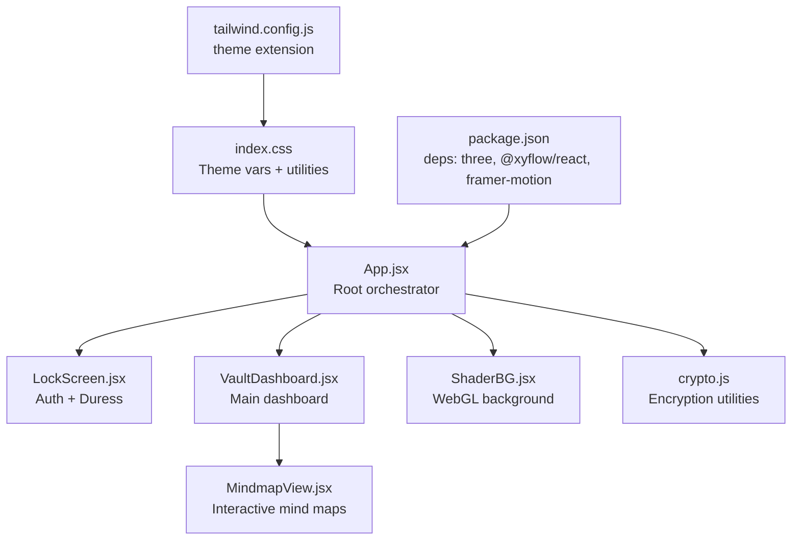
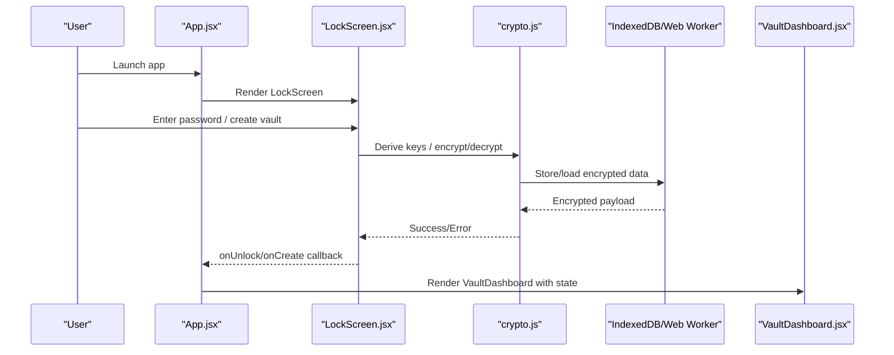
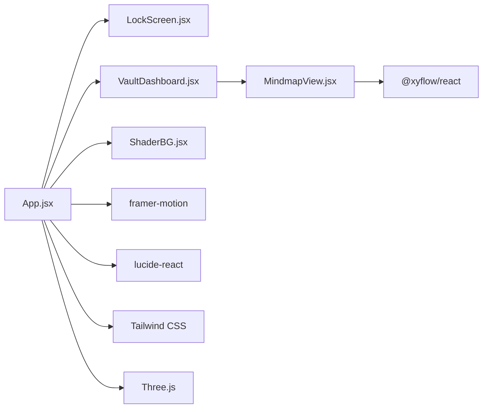

# User Interface Components

<cite>
**Referenced Files in This Document**
- [src/components/LockScreen.jsx](file://src/components/LockScreen.jsx)
- [src/components/VaultDashboard.jsx](file://src/components/VaultDashboard.jsx)
- [src/components/MindmapView.jsx](file://src/components/MindmapView.jsx)
- [src/components/ShaderBG.jsx](file://src/components/ShaderBG.jsx)
- [src/App.jsx](file://src/App.jsx)
- [src/lib/crypto.js](file://src/lib/crypto.js)
- [src/index.css](file://src/index.css)
- [tailwind.config.js](file://tailwind.config.js)
- [package.json](file://package.json)
</cite>

## Table of Contents
1. [Introduction](#introduction)
2. [Project Structure](#project-structure)
3. [Core Components](#core-components)
4. [Architecture Overview](#architecture-overview)
5. [Detailed Component Analysis](#detailed-component-analysis)
6. [Dependency Analysis](#dependency-analysis)
7. [Performance Considerations](#performance-considerations)
8. [Troubleshooting Guide](#troubleshooting-guide)
9. [Conclusion](#conclusion)
10. [Appendices](#appendices)

## Introduction
This document provides comprehensive UI component documentation for OMNI-TODO’s interface system. It covers:
- Authentication LockScreen with creation/unlock modes, password management, and duress detection
- VaultDashboard main interface including navigation, data organization, and view switching
- MindmapView interactive diagram editor with node management, AI integration, and visual editing capabilities
- ShaderBG dynamic WebGL background system with theme integration and performance optimization
It includes component props, events, customization options, integration patterns, usage examples, responsive design considerations, accessibility compliance guidelines, component composition patterns, and cross-browser compatibility notes.

## Project Structure
The UI is built with React and styled using Tailwind CSS. Theming is driven by CSS variables and Tailwind’s theme extension. Three.js powers the WebGL background, and @xyflow/react enables interactive mind maps.

**Diagram sources**
- [src/App.jsx:204-255](file://src/App.jsx#L204-L255)
- [src/components/LockScreen.jsx:98-221](file://src/components/LockScreen.jsx#L98-L221)
- [src/components/VaultDashboard.jsx:1389-1540](file://src/components/VaultDashboard.jsx#L1389-L1540)
- [src/components/MindmapView.jsx:7-310](file://src/components/MindmapView.jsx#L7-L310)
- [src/components/ShaderBG.jsx:108-176](file://src/components/ShaderBG.jsx#L108-L176)
- [src/lib/crypto.js:1-112](file://src/lib/crypto.js#L1-L112)
- [src/index.css:7-50](file://src/index.css#L7-L50)
- [tailwind.config.js:7-26](file://tailwind.config.js#L7-L26)
- [package.json:12-24](file://package.json#L12-L24)

**Section sources**
- [src/App.jsx:204-255](file://src/App.jsx#L204-L255)
- [src/index.css:7-50](file://src/index.css#L7-L50)
- [tailwind.config.js:7-26](file://tailwind.config.js#L7-L26)
- [package.json:12-24](file://package.json#L12-L24)

## Core Components
- LockScreen: Handles authentication with two modes (create/unlock), password input, visibility toggle, submission, and error feedback. Integrates with the crypto layer for unlocking and file import.
- VaultDashboard: Main application shell with sidebar navigation, tabs for Base View, Projects, Mindmaps, OMNI AI, Gallery, and Settings. Manages state via a reducer and integrates with the encryption layer for persistence.
- MindmapView: Interactive mind map editor powered by @xyflow/react. Supports adding nodes, connecting edges, AI-driven extraction, and theme-aware rendering.
- ShaderBG: Dynamic WebGL background using Three.js with configurable shader type, color, and opacity. Automatically adapts to theme and device pixel ratio.

**Section sources**
- [src/components/LockScreen.jsx:98-221](file://src/components/LockScreen.jsx#L98-L221)
- [src/components/VaultDashboard.jsx:1389-1540](file://src/components/VaultDashboard.jsx#L1389-L1540)
- [src/components/MindmapView.jsx:7-310](file://src/components/MindmapView.jsx#L7-L310)
- [src/components/ShaderBG.jsx:108-176](file://src/components/ShaderBG.jsx#L108-L176)

## Architecture Overview
The application uses a layered architecture:
- UI Layer: React components (LockScreen, VaultDashboard, MindmapView, ShaderBG)
- State Layer: useReducer in VaultDashboard orchestrating BaseView, Projects, Mindmaps, OMNI AI, Gallery, and Settings views
- Persistence Layer: Encryption utilities and IndexedDB/Web Workers for secure note storage
- Rendering Layer: Tailwind CSS for theming and animations; Three.js for WebGL backgrounds; @xyflow/react for mind maps

**Diagram sources**
- [src/App.jsx:204-255](file://src/App.jsx#L204-L255)
- [src/components/LockScreen.jsx:98-221](file://src/components/LockScreen.jsx#L98-L221)
- [src/lib/crypto.js:1-112](file://src/lib/crypto.js#L1-L112)
- [src/components/VaultDashboard.jsx:1389-1540](file://src/components/VaultDashboard.jsx#L1389-L1540)

## Detailed Component Analysis

### LockScreen Component
Purpose:
- Authenticate users with master password
- Create new vaults with password confirmation
- Open existing .vault files
- Provide duress detection via a special PIN triggering cryptographic destruction

Props:
- mode: 'create' | 'unlock'
- setMode: (mode) => void
- onUnlock: (password) => Promise<void>
- onCreate: (password) => Promise<void>
- onOpenFile: (file) => void
- hasVault: boolean
- error: string

Behavior highlights:
- Password masking toggle
- Submission disabled during busy states
- Enter key support for form submission
- Error messaging for invalid credentials
- File picker integration for .vault/.txt
- Duress PIN triggers destruction flow

Accessibility:
- Proper labeling and focus order
- Keyboard navigation (Enter to submit)
- Sufficient color contrast via theme variables

Security:
- Uses PBKDF2-derived keys for encryption/decryption
- Duress PIN triggers immediate data destruction

Integration patterns:
- Called by App.jsx to manage authentication lifecycle
- Emits callbacks to App.jsx for unlock/create/open actions

Customization:
- Theme-aware styling via CSS variables
- Configurable error messages and prompts

**Section sources**
- [src/components/LockScreen.jsx:98-221](file://src/components/LockScreen.jsx#L98-L221)
- [src/App.jsx:216-235](file://src/App.jsx#L216-L235)
- [src/lib/crypto.js:7-38](file://src/lib/crypto.js#L7-L38)

### VaultDashboard Component
Purpose:
- Central hub for managing notes, projects, mind maps, gallery, and settings
- Tabbed interface with animated transitions
- State orchestration via reducer

Props:
- state: object (from reducer)
- dispatch: (action) => void
- onLock: () => void
- onExportVault: () => void

Views:
- Base View: Notes editor with tag extraction, search, and tag filtering
- Projects View: Project management with progress bars and issue creation
- Mindmaps View: Mindmap editor integrated with VaultDashboard
- OMNI AI View: Personal assistant with AI parsing and action execution
- Gallery View: AI image generation and gallery management
- Settings View: Theme selection, export/import, and API auth configuration

Navigation:
- Collapsible sidebar with icons and labels
- Mobile-friendly menu toggle
- Active tab highlighting

Data organization:
- Notes stored with metadata (title, tags, preview, timestamps)
- Projects with status and progress
- Mindmaps with nodes and edges
- Gallery with base64 images

View switching:
- Animated transitions between views
- Persistent state across tabs

**Section sources**
- [src/components/VaultDashboard.jsx:1389-1540](file://src/components/VaultDashboard.jsx#L1389-L1540)
- [src/components/VaultDashboard.jsx:28-134](file://src/components/VaultDashboard.jsx#L28-L134)
- [src/components/VaultDashboard.jsx:1388-1540](file://src/components/VaultDashboard.jsx#L1388-L1540)

### MindmapView Component
Purpose:
- Interactive mind map editor with drag-and-drop, edge creation, and minimap
- AI-powered mind map generation from text
- Theme-aware rendering

Props:
- state: object containing mindmaps array
- dispatch: (action) => void

Features:
- Create new mind maps with root node
- Edit nodes and edges via React Flow
- Connect nodes to form relationships
- AI extraction: send text to /api/omni and parse JSON to populate nodes/edges
- Manual node addition
- Responsive layout with sidebar and canvas

Events:
- onNodesChange, onEdgesChange, onConnect
- generateWithAI (async)

Customization:
- Theme-aware controls and background colors
- Circular layout for AI-generated nodes

**Section sources**
- [src/components/MindmapView.jsx:7-310](file://src/components/MindmapView.jsx#L7-L310)

### ShaderBG Component
Purpose:
- Dynamic WebGL background with animated shaders
- Theme-integrated color and opacity
- Lightweight and performance-conscious

Props:
- type: 'noise' | 'aurora'
- color: string (CSS color)
- opacity: number (0–1)

Implementation:
- Vertex shader defines UV coordinates
- Fragment shaders implement noise/perlin-based animations
- Three.js Orthographic camera renders a full-plane quad
- Automatic resize handling and cleanup
- Device pixel ratio aware

Performance:
- Single-pass render loop
- Cleanup on unmount to prevent memory leaks
- Alpha-enabled renderer for composited backgrounds

**Section sources**
- [src/components/ShaderBG.jsx:108-176](file://src/components/ShaderBG.jsx#L108-L176)

## Dependency Analysis
External libraries and integrations:
- Three.js: WebGL background rendering
- @xyflow/react: Mind map canvas and interactions
- framer-motion: Smooth animations and transitions
- lucide-react: Icons
- Tailwind CSS: Utility-first styling and theme variables

**Diagram sources**
- [package.json:12-24](file://package.json#L12-L24)
- [src/App.jsx:204-255](file://src/App.jsx#L204-L255)
- [src/components/MindmapView.jsx:4](file://src/components/MindmapView.jsx#L4)
- [src/components/ShaderBG.jsx:115-116](file://src/components/ShaderBG.jsx#L115-L116)

**Section sources**
- [package.json:12-24](file://package.json#L12-L24)
- [src/App.jsx:204-255](file://src/App.jsx#L204-L255)

## Performance Considerations
- MindmapView: Defer heavy computations; use memoization for derived data; keep node count manageable
- ShaderBG: Cancel animation frames and dispose resources; avoid frequent re-renders
- VaultDashboard: Debounce auto-save; lazy-load heavy views; optimize list rendering
- LockScreen: Disable buttons during async operations; avoid repeated submissions
- Three.js: Use device pixel ratio; minimize uniforms updates; dispose geometries/materials on unmount

[No sources needed since this section provides general guidance]

## Troubleshooting Guide
Common issues and resolutions:
- Authentication failures:
  - Verify password correctness and vault integrity
  - Check for “DURESS_TRIGGERED” errors indicating destructive mode activation
- Mind map generation:
  - Ensure /api/omni responds with valid JSON
  - Validate node/edge structures before dispatching updates
- WebGL background:
  - Confirm Three.js is loaded and DOM element exists
  - Check for resize event handlers and cleanup on unmount
- Export/Import:
  - Validate .vault file format and encryption keys
  - Confirm IndexedDB availability and permissions

**Section sources**
- [src/App.jsx:216-235](file://src/App.jsx#L216-L235)
- [src/components/MindmapView.jsx:78-152](file://src/components/MindmapView.jsx#L78-L152)
- [src/components/ShaderBG.jsx:111-170](file://src/components/ShaderBG.jsx#L111-L170)
- [src/lib/crypto.js:29-38](file://src/lib/crypto.js#L29-L38)

## Conclusion
OMNI-TODO’s UI components combine robust security, modern visuals, and interactive experiences. The LockScreen ensures safe access with duress protection, VaultDashboard centralizes productivity workflows, MindmapView enables creative knowledge structuring, and ShaderBG delivers immersive theming. Together, they form a cohesive, accessible, and performant interface system.

[No sources needed since this section summarizes without analyzing specific files]

## Appendices

### Props Reference

- LockScreen
  - mode: 'create' | 'unlock'
  - setMode: (mode) => void
  - onUnlock: (password) => Promise<void>
  - onCreate: (password) => Promise<void>
  - onOpenFile: (file) => void
  - hasVault: boolean
  - error: string

- VaultDashboard
  - state: object
  - dispatch: (action) => void
  - onLock: () => void
  - onExportVault: () => void

- MindmapView
  - state: object
  - dispatch: (action) => void

- ShaderBG
  - type: 'noise' | 'aurora'
  - color: string
  - opacity: number

**Section sources**
- [src/components/LockScreen.jsx:98-221](file://src/components/LockScreen.jsx#L98-L221)
- [src/components/VaultDashboard.jsx:1389-1540](file://src/components/VaultDashboard.jsx#L1389-L1540)
- [src/components/MindmapView.jsx:7-310](file://src/components/MindmapView.jsx#L7-L310)
- [src/components/ShaderBG.jsx:108-176](file://src/components/ShaderBG.jsx#L108-L176)

### Events and Callbacks
- LockScreen: onUnlock, onCreate, onOpenFile
- VaultDashboard: onLock, onExportVault
- MindmapView: onNodesChange, onEdgesChange, onConnect, generateWithAI
- ShaderBG: automatic resize and cleanup

**Section sources**
- [src/components/LockScreen.jsx:105-119](file://src/components/LockScreen.jsx#L105-L119)
- [src/components/VaultDashboard.jsx:1389-1540](file://src/components/VaultDashboard.jsx#L1389-L1540)
- [src/components/MindmapView.jsx:33-76](file://src/components/MindmapView.jsx#L33-L76)
- [src/components/ShaderBG.jsx:149-170](file://src/components/ShaderBG.jsx#L149-L170)

### Accessibility Guidelines
- Keyboard navigation: Ensure all interactive elements are reachable via Tab
- Focus management: Clear focus styles and avoid focus traps
- Color contrast: Use theme variables to maintain sufficient contrast
- Screen readers: Provide meaningful aria-labels and roles where applicable
- Reduced motion: Respect prefers-reduced-motion media queries

**Section sources**
- [src/index.css:7-50](file://src/index.css#L7-L50)
- [tailwind.config.js:12-22](file://tailwind.config.js#L12-L22)

### Responsive Design Notes
- Sidebar collapses to icons-only on small screens
- Mindmap canvas and gallery adapt to viewport
- Mindmap AI panel stacks on smaller viewports
- ShaderBG scales to container size

**Section sources**
- [src/components/VaultDashboard.jsx:1412-1480](file://src/components/VaultDashboard.jsx#L1412-L1480)
- [src/components/MindmapView.jsx:174-238](file://src/components/MindmapView.jsx#L174-L238)

### Cross-Browser Compatibility
- Three.js requires WebGL support; fallbacks are not implemented in ShaderBG
- @xyflow/react depends on modern browser APIs; ensure polyfills if targeting legacy browsers
- Tailwind utilities are widely supported; verify vendor prefixes if needed
- IndexedDB and Web Crypto APIs are used; confirm availability in target environments

**Section sources**
- [package.json:12-24](file://package.json#L12-L24)
- [src/components/ShaderBG.jsx:115-116](file://src/components/ShaderBG.jsx#L115-L116)
- [src/lib/crypto.js:1-112](file://src/lib/crypto.js#L1-L112)