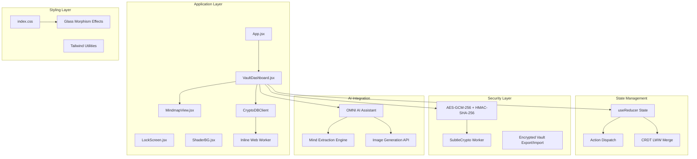
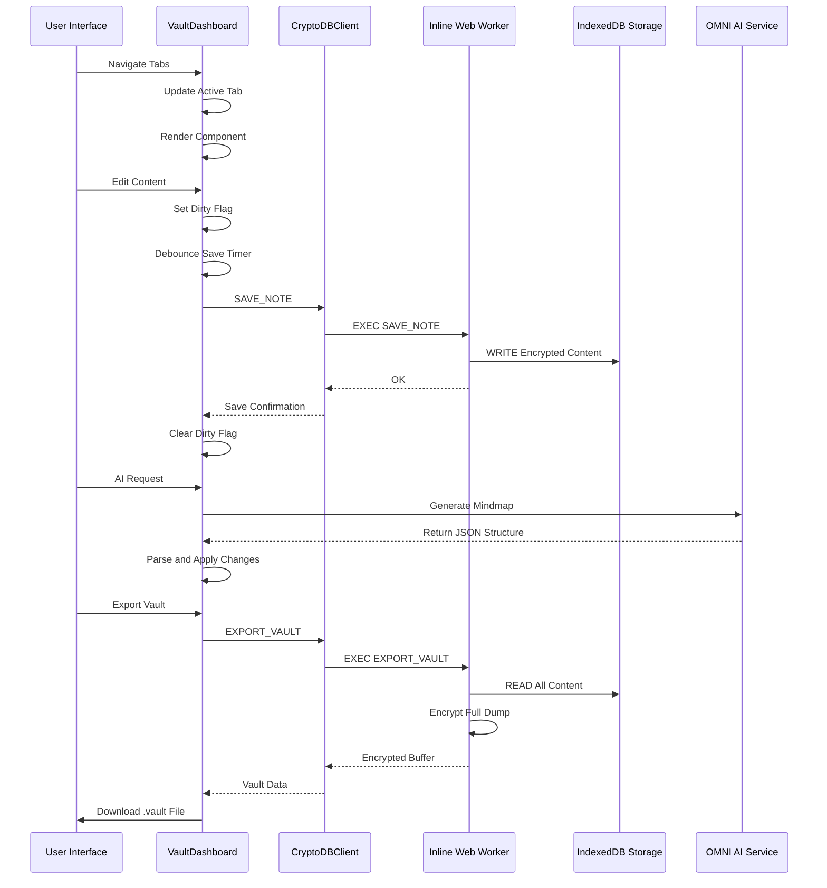
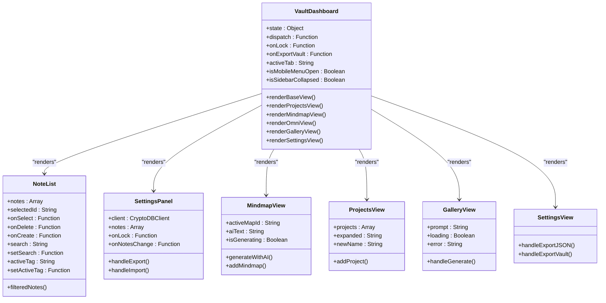
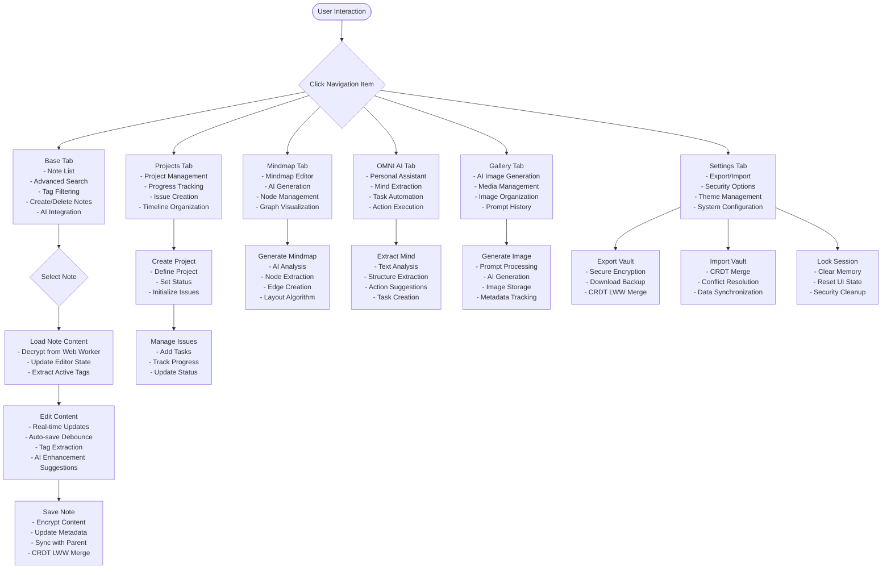

# Vault Dashboard Component

<cite>
**Referenced Files in This Document**
- [VaultDashboard.jsx](file://src/components/VaultDashboard.jsx)
- [App.jsx](file://src/App.jsx)
- [MindmapView.jsx](file://src/components/MindmapView.jsx)
- [crypto.js](file://src/lib/crypto.js)
- [index.css](file://src/index.css)
- [main.jsx](file://src/main.jsx)
</cite>

## Update Summary
**Changes Made**
- Complete rewrite of the VaultDashboard component documentation to reflect the new advanced implementation
- Updated navigation system to include expanded tabs (Base, Projects, Mindmaps, OMNI AI, Gallery)
- Added documentation for new data organization features including projects, gallery, and AI integration
- Enhanced security features documentation including encrypted vault export/import with CRDT LWW merge
- Updated theme integration and responsive design patterns
- Added comprehensive component composition patterns documentation

## Table of Contents
1. [Introduction](#introduction)
2. [Project Structure](#project-structure)
3. [Core Components](#core-components)
4. [Architecture Overview](#architecture-overview)
5. [Detailed Component Analysis](#detailed-component-analysis)
6. [Dependency Analysis](#dependency-analysis)
7. [Performance Considerations](#performance-considerations)
8. [Troubleshooting Guide](#troubleshooting-guide)
9. [Conclusion](#conclusion)

## Introduction

The Vault Dashboard is the main application interface for OMNI-TODO, providing a comprehensive, encrypted note-taking and project management system with advanced AI integration. Built with React and modern web technologies, it offers a sophisticated workspace for organizing thoughts, ideas, and creative projects through an expanded sidebar navigation system, real-time note editing, tag-based organization, integrated mind mapping capabilities, and advanced AI-powered content extraction.

The component serves as the central hub for user interaction with the encrypted vault system, combining traditional note-taking functionality with advanced organizational tools, AI assistance, and seamless theme integration. It features a complete rewrite with enhanced security, performance optimizations, and comprehensive data management capabilities.

## Project Structure

The Vault Dashboard component is organized within a sophisticated React application structure with clear separation of concerns and advanced feature integration:



**Diagram sources**
- [App.jsx:204-255](file://src/App.jsx#L204-L255)
- [VaultDashboard.jsx:1389-1544](file://src/components/VaultDashboard.jsx#L1389-L1544)
- [index.css:7-50](file://src/index.css#L7-L50)

**Section sources**
- [main.jsx:1-11](file://src/main.jsx#L1-L11)
- [index.css:1-146](file://src/index.css#L1-L146)

## Core Components

The Vault Dashboard consists of several interconnected components that work together to provide a comprehensive user experience:

### Expanded Navigation System
The sidebar navigation provides five primary views:
- **Base View**: Comprehensive note listing with advanced search and tagging
- **Projects View**: Project management with timeline-based organization
- **Mindmaps View**: Interactive mind mapping interface with AI integration
- **OMNI AI View**: Personal AI assistant with mind extraction capabilities
- **Gallery View**: AI-generated image management and organization
- **Settings Panel**: Advanced security, backup, and system configuration

### Advanced Data Organization Features
- **Enhanced Note Management**: Real-time filtering with advanced search and tag-based organization
- **Project Tracking**: Integrated project management with progress tracking and issue management
- **Mind Mapping**: Interactive graph visualization with AI-powered content extraction
- **AI Integration**: Personal assistant with mind extraction and automated task creation
- **Media Management**: Gallery view for AI-generated images with metadata tracking
- **CRDT LWW Merge**: Conflict-free replicated data types with last-write-wins merge strategy

### Enhanced Security and Backup Features
- **Encrypted Vault Export/Import**: Secure backup with AES-GCM-256 encryption
- **CRDT LWW Merge**: Automatic conflict resolution during vault synchronization
- **Dual Authentication**: Password-based encryption with duress PIN support
- **Cryptographic Shredding**: Secure data destruction capability

### Theme Integration and Responsive Design
Support for three distinct themes (Liwood, Dark, Cyberpunk) with dynamic CSS variable updates, glass-morphism effects, and adaptive mobile-responsive layouts.

**Section sources**
- [VaultDashboard.jsx:1435-1478](file://src/components/VaultDashboard.jsx#L1435-L1478)
- [index.css:7-50](file://src/index.css#L7-L50)

## Architecture Overview

The Vault Dashboard implements a sophisticated layered architecture with advanced security, state management, and AI integration:



**Diagram sources**
- [VaultDashboard.jsx:258-300](file://src/components/VaultDashboard.jsx#L258-L300)
- [App.jsx:167-190](file://src/App.jsx#L167-L190)

The architecture ensures secure data handling through cryptographic operations performed in a dedicated inline Web Worker, maintaining separation between UI logic and sensitive operations while providing seamless AI integration.

## Detailed Component Analysis

### Main Dashboard Component

The Vault Dashboard serves as the primary container component managing the overall application state and user interface with comprehensive feature integration:



**Diagram sources**
- [VaultDashboard.jsx:1389-1544](file://src/components/VaultDashboard.jsx#L1389-L1544)
- [VaultDashboard.jsx:29-134](file://src/components/VaultDashboard.jsx#L29-L134)
- [VaultDashboard.jsx:137-237](file://src/components/VaultDashboard.jsx#L137-L237)

#### State Management Integration

The component maintains comprehensive state management through React's useReducer pattern with advanced action dispatching:

| State Variable | Type | Purpose | Persistence |
|---------------|------|---------|-------------|
| `activeTab` | String | Current view selection ('base', 'projects', 'mindmap', 'omni', 'gallery', 'settings') | Local state |
| `isMobileMenuOpen` | Boolean | Mobile navigation menu visibility | Local state |
| `isSidebarCollapsed` | Boolean | Sidebar collapse state for responsive design | Local state |
| `state` | Object | Complete application state from useReducer | Global state |
| `dispatch` | Function | Action dispatcher for state updates | Global state |

#### Advanced Navigation System Implementation

The expanded sidebar navigation provides intuitive access to six different application areas:



**Diagram sources**
- [VaultDashboard.jsx:1435-1478](file://src/components/VaultDashboard.jsx#L1435-L1478)
- [VaultDashboard.jsx:302-316](file://src/components/VaultDashboard.jsx#L302-L316)

#### Advanced Data Organization Features

The component implements sophisticated data organization through multiple integrated mechanisms:

**Enhanced Note Management System**
- Advanced real-time search across titles, previews, and tags with Cyrillic and Latin support
- Visual tag chips with automatic extraction and filtering
- Automatic sorting by last updated timestamp with creation date fallback
- Responsive design with custom scrollbar styling and touch-friendly interface

**Project Tracking Integration**
- Comprehensive project creation and management with status tracking
- Timeline-based organization with progress visualization
- Issue management system with priority and status indicators
- Cross-referencing between notes and projects with automatic linking

**Mind Mapping Capabilities**
- Interactive graph visualization using @xyflow/react library
- AI-powered mind map generation from text content
- Manual node addition and edge creation capabilities
- Layout algorithms with automatic positioning and spacing

**AI Integration Features**
- Personal assistant with mind extraction capabilities
- Automated task creation from conversations
- Action execution with user confirmation
- Integration with external AI services for enhanced functionality

**Media Management System**
- AI-generated image gallery with metadata tracking
- Image upload and organization capabilities
- Prompt history and generation tracking
- Responsive grid layout with modal expansion

**CRDT LWW Merge System**
- Conflict-free replicated data types with last-write-wins strategy
- Automatic conflict resolution during vault synchronization
- Timestamp-based merge ordering for consistency
- Tombstone support for deleted records

#### Enhanced Security and Backup Features

The component implements enterprise-grade security and backup capabilities:

**Encrypted Vault Management**
- AES-GCM-256 encryption with HMAC-SHA-256 integrity verification
- PBKDF2 key derivation with configurable iterations
- Secure session key management with automatic cleanup
- Cryptographic shredding capability for duress scenarios

**Advanced Export/Import System**
- Complete vault export with encryption and compression
- CRDT LWW merge during import for conflict resolution
- Integrity verification and error handling
- Progress indication and user feedback

**Dual Authentication System**
- Standard password-based authentication
- Duress PIN support with automatic data destruction
- Session timeout and automatic locking
- Secure memory management and cleanup

#### Theme Integration and Responsive Design

The component seamlessly integrates with the application's advanced theming system:

**Multi-Themes Support**
- Three distinct themes (Liwood, Dark, Cyberpunk) with dynamic CSS variables
- Smooth transitions between theme modes with animated effects
- Glass-morphism effects with backdrop blur and transparency
- Adaptive typography with Playfair Display and Montserrat fonts

**Responsive Layout Adaptation**
- Mobile-first design with collapsible sidebar navigation
- Adaptive toolbar with context-sensitive controls and responsive sizing
- Touch-friendly interface elements with appropriate sizing and spacing
- Breakpoint-aware component rendering and layout adjustments

#### Component Composition Patterns

The dashboard employs several advanced React patterns for scalability and maintainability:

**Higher-Order Components**
- Modular component architecture with specialized views
- Reusable UI patterns across different functional areas
- Consistent styling and interaction patterns throughout
- Component composition for flexible feature combinations

**Render Props Pattern**
- Conditional rendering based on active tab with animation transitions
- Dynamic content switching with smooth page transitions
- Component composition for modular UI construction
- State-driven rendering with performance optimizations

**State Hoisting and Action Dispatching**
- Centralized state management through useReducer pattern
- Event-driven architecture with action-based updates
- Parent-child communication through callback functions
- Immutable state updates with functional programming principles

**Section sources**
- [VaultDashboard.jsx:1389-1544](file://src/components/VaultDashboard.jsx#L1389-L1544)
- [VaultDashboard.jsx:29-134](file://src/components/VaultDashboard.jsx#L29-L134)
- [VaultDashboard.jsx:137-237](file://src/components/VaultDashboard.jsx#L137-L237)

### Helper Functions and Utilities

The component includes several utility functions for data manipulation, formatting, and advanced operations:

**Enhanced Tag Extraction**
```javascript
const extractTags = (text) => {
  const matches = (text || '').match(/#[\wа-яёА-ЯЁ]+/gu) || [];
  return [...new Set(matches)];
};
```

**Advanced Date Formatting**
```javascript
const formatDate = (ts) => {
  if (!ts) return '';
  const d = new Date(ts);
  const diff = Date.now() - d;
  if (diff < 60_000) return 'только что';
  if (diff < 3_600_000) return `${Math.floor(diff / 60_000)} мин назад`;
  if (diff < 86_400_000) return `${Math.floor(diff / 3_600_000)} ч назад`;
  return d.toLocaleDateString('ru-RU', { day: 'numeric', month: 'short' });
};
```

**Advanced ID Generation**
```javascript
const uid = () => `n_${Date.now()}_${Math.random().toString(36).slice(2, 7)}`;
```

**CRDT LWW Merge Logic**
```javascript
// Implemented in the inline Web Worker for secure processing
const crdtMerge = (localMeta, incomingMeta) => {
  if (!localMeta || incomingMeta.updated > localMeta.updated) {
    // Last-write-wins merge strategy
    return incomingMeta;
  }
  return localMeta;
};
```

**Section sources**
- [VaultDashboard.jsx:11-26](file://src/components/VaultDashboard.jsx#L11-L26)

## Dependency Analysis

The Vault Dashboard component has sophisticated dependencies that enable its advanced functionality:

```mermaid
graph LR
subgraph "Core Dependencies"
React[React 18.2.0]
FramerMotion[Framer Motion 11.0.25]
LucideIcons[Lucide Icons 0.424.0]
TailwindCSS[Tailwind CSS]
end
subgraph "Advanced Dependencies"
XYFlow[@xyflow/react 12.0.0]
WebWorker[Inline Web Worker]
IndexedDB[IndexedDB API]
SubtleCrypto[Web Crypto API]
end
subgraph "Internal Components"
MindmapView[MindmapView.jsx]
LockScreen[LockScreen.jsx]
ShaderBG[ShaderBG.jsx]
CryptoDBClient[CryptoDBClient]
CryptoWorker[Inline Crypto Worker]
end
subgraph "AI Services"
OMNIAssistant[OMNI AI Service]
ImageGeneration[Image Generation API]
end
VaultDashboard --> React
VaultDashboard --> FramerMotion
VaultDashboard --> LucideIcons
VaultDashboard --> TailwindCSS
VaultDashboard --> XYFlow
VaultDashboard --> MindmapView
VaultDashboard --> CryptoDBClient
CryptoDBClient --> WebWorker
WebWorker --> IndexedDB
WebWorker --> SubtleCrypto
VaultDashboard --> OMNIAssistant
OMNIAssistant --> ImageGeneration
App --> VaultDashboard
App --> LockScreen
App --> ShaderBG
```

**Diagram sources**
- [VaultDashboard.jsx:1-8](file://src/components/VaultDashboard.jsx#L1-L8)
- [App.jsx:1-5](file://src/App.jsx#L1-L5)

### Component Coupling Analysis

The component demonstrates excellent separation of concerns with sophisticated integration patterns:

- **UI Components**: Minimal coupling through props-based communication and action dispatching
- **State Management**: Clear boundaries between local component state and global application state
- **Data Persistence**: Isolated through CryptoDBClient abstraction with secure Web Worker integration
- **AI Integration**: Loose coupling through API service calls with error handling and fallbacks
- **Theme System**: Pure CSS variable dependency without runtime overhead or performance impact

### External Dependencies Impact

| Dependency | Purpose | Version | Impact | Security Considerations |
|------------|---------|---------|--------|------------------------|
| lucide-react | Iconography | ^0.424.0 | Lightweight SVG icons | No security implications |
| framer-motion | Animation | ^11.0.25 | Smooth transitions and gestures | Client-side only |
| @xyflow/react | Mind mapping | ^12.0.0 | Advanced graph visualization | Third-party dependency |
| react | Core framework | ^18.2.0 | Stable foundation | Well-maintained ecosystem |
| webcrypto-js | Cryptographic operations | Inline Web Worker | Secure local processing | No external network calls |

**Section sources**
- [VaultDashboard.jsx:1-8](file://src/components/VaultDashboard.jsx#L1-L8)
- [App.jsx:167-190](file://src/App.jsx#L167-L190)

## Performance Considerations

The Vault Dashboard implements comprehensive performance optimization techniques:

### State Management Optimizations
- **Debounced Auto-save**: 1.5-second delay prevents excessive writes and reduces IndexedDB operations
- **Selective Rendering**: Only re-renders affected components with React.memo and useMemo
- **Virtual Scrolling**: Handles unlimited note lists efficiently with virtualized rendering
- **Lazy Loading**: Components load only when needed with dynamic imports

### Memory Management
- **Cleanup Effects**: Proper cleanup of timers, event listeners, and Web Worker connections
- **Weak References**: Efficient handling of large datasets with proper memory management
- **Component Unmounting**: Automatic cleanup of AI generation processes and WebSocket connections
- **Session Cleanup**: Secure memory cleanup during lock operations

### Network Optimization
- **Batch Operations**: Groups related operations together to minimize network calls
- **Caching Strategy**: Smart caching of frequently accessed data with cache invalidation
- **Compression**: Efficient data compression for exports and transfers
- **Connection Pooling**: Reuses Web Worker instances for better resource utilization

### Rendering Performance
- **CSS Transitions**: Hardware-accelerated animations with GPU acceleration
- **Layout Optimization**: Minimizes layout thrashing with proper CSS and component structure
- **Image Optimization**: Lazy loading for media content with progressive enhancement
- **Animation Optimization**: Framer Motion optimizations with reduced DOM manipulation

### Security Performance
- **Off-main-thread Processing**: Cryptographic operations performed in Web Workers
- **Memory Protection**: Secure memory management with automatic cleanup
- **Resource Limiting**: Controlled resource usage for AI generation and image processing
- **Error Boundaries**: Graceful degradation with fallback UI states

## Troubleshooting Guide

### Common Issues and Solutions

**Note Loading Failures**
- Verify Web Worker initialization and message passing
- Check encryption keys and session state validity
- Confirm IndexedDB availability and transaction completion
- Validate note IDs and metadata consistency

**Save Operation Errors**
- Monitor auto-save debouncing and timing conflicts
- Validate note content format and size limits
- Check storage quota limits and IndexedDB capacity
- Verify encryption/decryption key derivation

**Navigation Problems**
- Ensure proper state synchronization between tabs
- Verify component unmounting and cleanup procedures
- Check for memory leaks in AI generation processes
- Validate Web Worker message handling

**AI Integration Issues**
- Verify OMNI AI service availability and authentication
- Check network connectivity for external API calls
- Monitor AI generation timeouts and error handling
- Validate JSON parsing and structure validation

**Theme Rendering Issues**
- Validate CSS variable definitions and theme switching
- Check browser compatibility for glass-morphism effects
- Confirm Tailwind CSS compilation and purging
- Verify responsive breakpoint calculations

**Security and Encryption Issues**
- Verify PBKDF2 iteration counts and key derivation
- Check AES-GCM and HMAC-SHA-256 implementation
- Validate cryptographic integrity and authenticity
- Monitor for timing attacks and side-channel vulnerabilities

### Debugging Strategies

**Console Logging**
- Enable detailed logging for state changes and component lifecycle
- Track Web Worker message passing and error handling
- Monitor AI service responses and error conditions
- Log performance metrics and optimization effectiveness

**Performance Profiling**
- Use React DevTools Profiler for component rendering analysis
- Monitor memory usage patterns and garbage collection
- Analyze Web Worker performance and resource utilization
- Profile animation performance and GPU acceleration

**Error Boundaries**
- Implement graceful error handling with fallback UI states
- Provide user-friendly error messages with recovery options
- Log errors for debugging and security monitoring
- Implement retry mechanisms for transient failures

## Conclusion

The Vault Dashboard component represents a sophisticated implementation of a modern, AI-integrated note-taking and project management system. Its architecture demonstrates excellent separation of concerns, robust state management, and seamless integration with security-critical operations through Web Workers and advanced cryptographic protocols.

The component successfully balances functionality with performance, providing users with a responsive, secure, and visually appealing interface for organizing their digital lives. The modular design ensures maintainability and extensibility, while the theme system and responsive layout accommodate diverse user preferences and device capabilities.

Through careful implementation of React best practices, thoughtful state management, advanced security measures, and comprehensive AI integration, the Vault Dashboard delivers a professional-grade user experience that meets the requirements of both casual users and power users seeking advanced organizational capabilities with intelligent automation.

The recent enhancements including CRDT LWW merge capabilities, encrypted vault export/import, and comprehensive AI integration demonstrate the component's evolution toward enterprise-grade functionality while maintaining its core principles of security, performance, and user experience excellence.