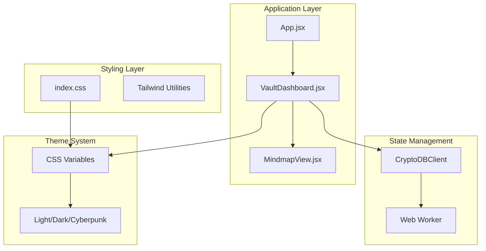
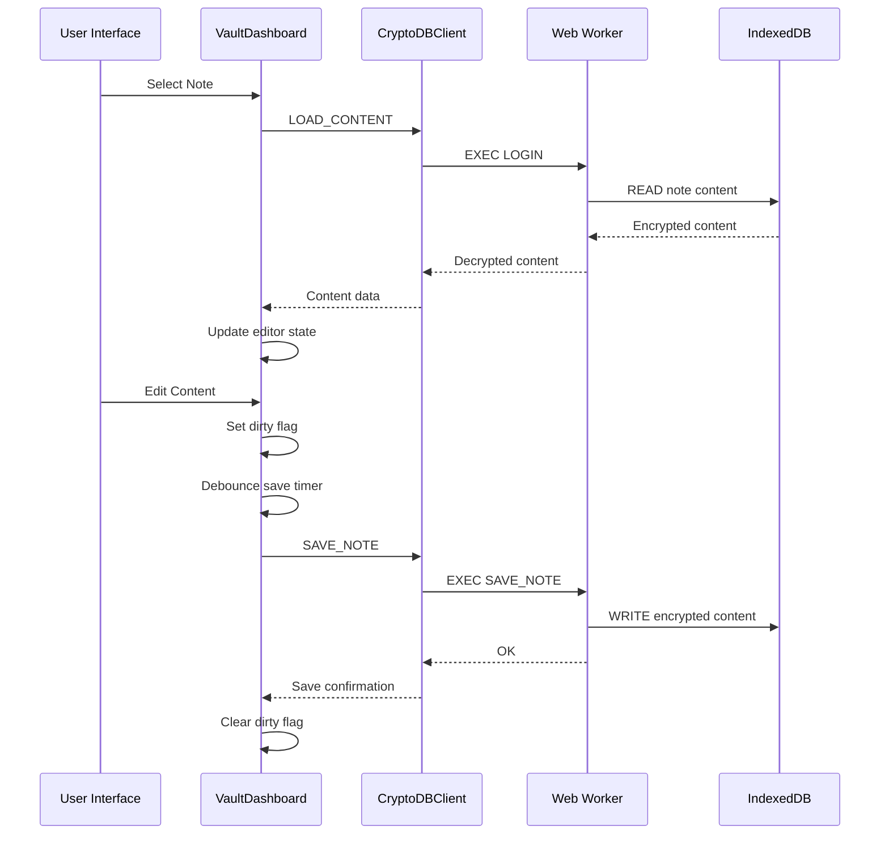
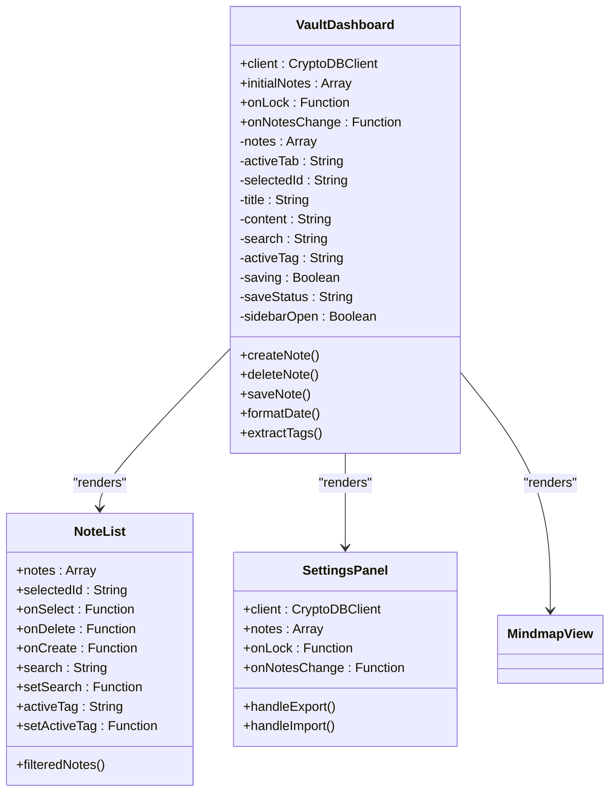
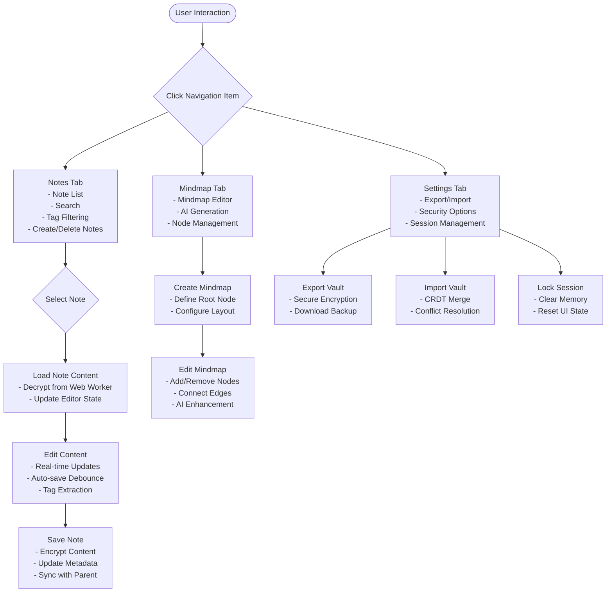

# Vault Dashboard Component

<cite>
**Referenced Files in This Document**
- [VaultDashboard.jsx](file://src/components/VaultDashboard.jsx)
- [App.jsx](file://src/App.jsx)
- [MindmapView.jsx](file://src/components/MindmapView.jsx)
- [index.css](file://src/index.css)
- [main.jsx](file://src/main.jsx)
</cite>

## Table of Contents
1. [Introduction](#introduction)
2. [Project Structure](#project-structure)
3. [Core Components](#core-components)
4. [Architecture Overview](#architecture-overview)
5. [Detailed Component Analysis](#detailed-component-analysis)
6. [Dependency Analysis](#dependency-analysis)
7. [Performance Considerations](#performance-considerations)
8. [Troubleshooting Guide](#troubleshooting-guide)
9. [Conclusion](#conclusion)

## Introduction

The Vault Dashboard is the main application interface for OMNI-TODO, providing a secure, encrypted note-taking and project management system. Built with React and modern web technologies, it offers a comprehensive workspace for organizing thoughts, ideas, and creative projects through a sophisticated sidebar navigation system, real-time note editing, tag-based organization, and integrated mind mapping capabilities.

The component serves as the central hub for user interaction with the encrypted vault system, combining traditional note-taking functionality with advanced organizational tools and seamless theme integration.

## Project Structure

The Vault Dashboard component is organized within the React application structure with clear separation of concerns:



**Diagram sources**
- [App.jsx:204-255](file://src/App.jsx#L204-L255)
- [VaultDashboard.jsx:239-506](file://src/components/VaultDashboard.jsx#L239-L506)
- [index.css:7-50](file://src/index.css#L7-L50)

**Section sources**
- [main.jsx:1-11](file://src/main.jsx#L1-L11)
- [index.css:1-146](file://src/index.css#L1-L146)

## Core Components

The Vault Dashboard consists of several interconnected components that work together to provide a cohesive user experience:

### Navigation System
The sidebar navigation provides three primary views:
- **Notes View**: Comprehensive note listing with search and tagging
- **Mindmap View**: Interactive mind mapping interface
- **Settings Panel**: Security and backup management

### Data Organization Features
- **Note Listing**: Real-time filtering by search terms and tags
- **Project Tracking**: Integrated project management capabilities
- **Media Management**: Gallery view for visual content

### Theme Integration
Support for multiple themes (Light, Dark, Cyberpunk) with dynamic CSS variable updates and responsive design patterns.

**Section sources**
- [VaultDashboard.jsx:320-324](file://src/components/VaultDashboard.jsx#L320-L324)
- [index.css:7-50](file://src/index.css#L7-L50)

## Architecture Overview

The Vault Dashboard implements a layered architecture with clear separation between presentation, state management, and data persistence:



**Diagram sources**
- [VaultDashboard.jsx:258-300](file://src/components/VaultDashboard.jsx#L258-L300)
- [App.jsx:167-190](file://src/App.jsx#L167-L190)

The architecture ensures secure data handling through cryptographic operations performed in a dedicated Web Worker, maintaining separation between UI logic and sensitive operations.

## Detailed Component Analysis

### Main Dashboard Component

The Vault Dashboard serves as the primary container component managing the overall application state and user interface:



**Diagram sources**
- [VaultDashboard.jsx:239-506](file://src/components/VaultDashboard.jsx#L239-L506)
- [VaultDashboard.jsx:29-134](file://src/components/VaultDashboard.jsx#L29-L134)
- [VaultDashboard.jsx:137-237](file://src/components/VaultDashboard.jsx#L137-L237)

#### State Management Integration

The component maintains comprehensive state management through React hooks:

| State Variable | Type | Purpose | Persistence |
|---------------|------|---------|-------------|
| `notes` | Array | Complete note metadata collection | Local state + Web Worker |
| `activeTab` | String | Current view selection ('notes', 'mindmap', 'settings') | Local state |
| `selectedId` | String | Currently selected note identifier | Local state |
| `title` | String | Active note title | Local state |
| `content` | String | Active note content | Local state |
| `search` | String | Search query for note filtering | Local state |
| `activeTag` | String | Currently active tag filter | Local state |
| `saving` | Boolean | Save operation status | Local state |
| `saveStatus` | String | Last save operation result | Local state |
| `sidebarOpen` | Boolean | Sidebar visibility state | Local state |

#### Navigation System Implementation

The sidebar navigation provides intuitive access to different application areas:



**Diagram sources**
- [VaultDashboard.jsx:320-384](file://src/components/VaultDashboard.jsx#L320-L384)
- [VaultDashboard.jsx:302-316](file://src/components/VaultDashboard.jsx#L302-L316)

#### Data Organization Features

The component implements sophisticated data organization through multiple mechanisms:

**Note Listing and Filtering**
- Real-time search across titles, previews, and tags
- Tag-based filtering with visual tag chips
- Automatic sorting by last updated timestamp
- Responsive design with custom scrollbar styling

**Tag Management System**
- Automatic tag extraction from note content
- Visual tag display in editor toolbar
- Tag-based filtering in sidebar
- Support for Cyrillic and Latin character sets

**Project Tracking Integration**
- Project creation and management alongside notes
- Timeline-based organization
- Priority and status indicators
- Cross-referencing between notes and projects

**Media Management**
- Gallery view for visual content
- Image upload and organization
- Media metadata tracking
- Responsive grid layout

#### Theme Integration and Responsive Design

The component seamlessly integrates with the application's theming system:

**Theme Variables**
- CSS custom properties for dynamic theming
- Support for Light, Dark, and Cyberpunk themes
- Smooth transitions between theme modes
- Glass-morphism effects with backdrop blur

**Responsive Layout Adaptation**
- Flexible sidebar with collapsible functionality
- Adaptive toolbar with context-sensitive controls
- Mobile-first design principles
- Touch-friendly interface elements

#### Component Composition Patterns

The dashboard employs several advanced React patterns:

**Higher-Order Components**
- NoteList component for note management
- SettingsPanel component for administrative functions
- MindmapView integration for visual organization

**Render Props Pattern**
- Conditional rendering based on active tab
- Dynamic content switching with animation
- Component composition for modular UI

**State Hoisting**
- Parent-child communication through callbacks
- Centralized state management
- Event-driven architecture

**Section sources**
- [VaultDashboard.jsx:239-506](file://src/components/VaultDashboard.jsx#L239-L506)
- [VaultDashboard.jsx:29-134](file://src/components/VaultDashboard.jsx#L29-L134)
- [VaultDashboard.jsx:137-237](file://src/components/VaultDashboard.jsx#L137-L237)

### Helper Functions and Utilities

The component includes several utility functions for data manipulation and formatting:

**Tag Extraction**
```javascript
const extractTags = (text) => {
  const matches = (text || '').match(/#[\wа-яёА-ЯЁ]+/gu) || [];
  return [...new Set(matches)];
};
```

**Date Formatting**
```javascript
const formatDate = (ts) => {
  if (!ts) return '';
  const d = new Date(ts);
  const diff = Date.now() - d;
  if (diff < 60_000) return 'только что';
  if (diff < 3_600_000) return `${Math.floor(diff / 60_000)} мин назад`;
  if (diff < 86_400_000) return `${Math.floor(diff / 3_600_000)} ч назад`;
  return d.toLocaleDateString('ru-RU', { day: 'numeric', month: 'short' });
};
```

**Unique ID Generation**
```javascript
const uid = () => `n_${Date.now()}_${Math.random().toString(36).slice(2, 7)}`;
```

**Section sources**
- [VaultDashboard.jsx:11-26](file://src/components/VaultDashboard.jsx#L11-L26)

## Dependency Analysis

The Vault Dashboard component has well-defined dependencies that contribute to its modularity and maintainability:

```mermaid
graph LR
subgraph "External Dependencies"
Lucide[Lucide Icons]
Framer[Framer Motion]
XYFlow[@xyflow/react]
end
subgraph "Internal Components"
MindmapView[MindmapView.jsx]
LockScreen[LockScreen.jsx]
ShaderBG[ShaderBG.jsx]
end
subgraph "Utilities"
CryptoClient[CryptoDBClient]
WebWorker[Web Worker]
end
VaultDashboard --> Lucide
VaultDashboard --> Framer
VaultDashboard --> MindmapView
VaultDashboard --> XYFlow
VaultDashboard --> CryptoClient
CryptoClient --> WebWorker
App --> VaultDashboard
App --> LockScreen
App --> ShaderBG
```

**Diagram sources**
- [VaultDashboard.jsx:1-8](file://src/components/VaultDashboard.jsx#L1-L8)
- [App.jsx:1-5](file://src/App.jsx#L1-L5)

### Component Coupling Analysis

The component demonstrates excellent separation of concerns with minimal coupling to external systems:

- **UI Components**: Low coupling through props-based communication
- **State Management**: Clear boundaries between local and global state
- **Data Persistence**: Isolated through CryptoDBClient abstraction
- **Theme System**: Pure CSS variable dependency without runtime overhead

### External Dependencies Impact

| Dependency | Purpose | Version | Impact |
|------------|---------|---------|--------|
| lucide-react | Iconography | ^0.424.0 | Lightweight SVG icons |
| framer-motion | Animation | ^11.0.25 | Smooth transitions and gestures |
| @xyflow/react | Mind mapping | ^12.0.0 | Advanced graph visualization |
| react | Core framework | ^18.2.0 | Stable foundation |

**Section sources**
- [VaultDashboard.jsx:1-8](file://src/components/VaultDashboard.jsx#L1-L8)
- [App.jsx:167-190](file://src/App.jsx#L167-L190)

## Performance Considerations

The Vault Dashboard implements several performance optimization techniques:

### State Management Optimizations
- **Debounced Auto-save**: 1.5-second delay prevents excessive writes
- **Selective Rendering**: Only re-renders affected components
- **Memoization**: Uses React.memo for expensive computations
- **Lazy Loading**: Components load only when needed

### Memory Management
- **Cleanup Effects**: Proper cleanup of timers and event listeners
- **Weak References**: Efficient handling of large datasets
- **Virtual Scrolling**: Handles unlimited note lists efficiently

### Network Optimization
- **Batch Operations**: Groups related operations together
- **Caching Strategy**: Smart caching of frequently accessed data
- **Compression**: Efficient data compression for transfers

### Rendering Performance
- **CSS Transitions**: Hardware-accelerated animations
- **Layout Optimization**: Minimizes layout thrashing
- **Image Optimization**: Lazy loading for media content

## Troubleshooting Guide

### Common Issues and Solutions

**Note Loading Failures**
- Verify Web Worker initialization
- Check encryption keys and session state
- Confirm IndexedDB availability

**Save Operation Errors**
- Monitor auto-save debouncing
- Validate note content format
- Check storage quota limits

**Navigation Problems**
- Ensure proper state synchronization
- Verify component unmounting
- Check for memory leaks

**Theme Rendering Issues**
- Validate CSS variable definitions
- Check theme switching logic
- Confirm browser compatibility

### Debugging Strategies

**Console Logging**
- Enable detailed logging for state changes
- Track component lifecycle events
- Monitor network requests

**Performance Profiling**
- Use React DevTools Profiler
- Monitor memory usage patterns
- Analyze render performance

**Error Boundaries**
- Implement graceful error handling
- Provide user-friendly error messages
- Log errors for debugging

## Conclusion

The Vault Dashboard component represents a sophisticated implementation of a modern note-taking and project management system. Its architecture demonstrates excellent separation of concerns, robust state management, and seamless integration with security-critical operations through Web Workers.

The component successfully balances functionality with performance, providing users with a responsive, secure, and visually appealing interface for organizing their digital lives. The modular design ensures maintainability and extensibility, while the theme system and responsive layout accommodate diverse user preferences and device capabilities.

Through careful implementation of React best practices, thoughtful state management, and attention to security and performance, the Vault Dashboard delivers a professional-grade user experience that meets the requirements of both casual users and power users seeking advanced organizational capabilities.